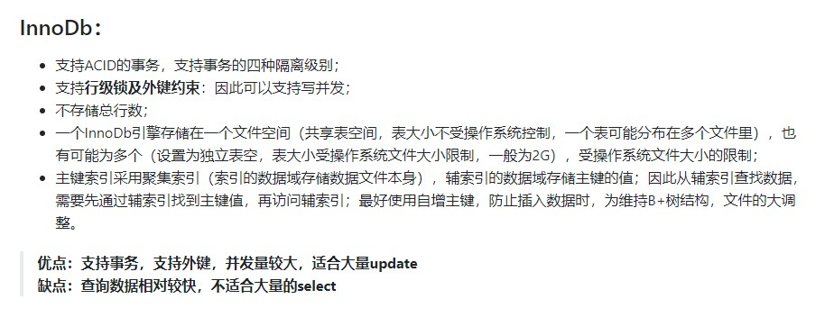
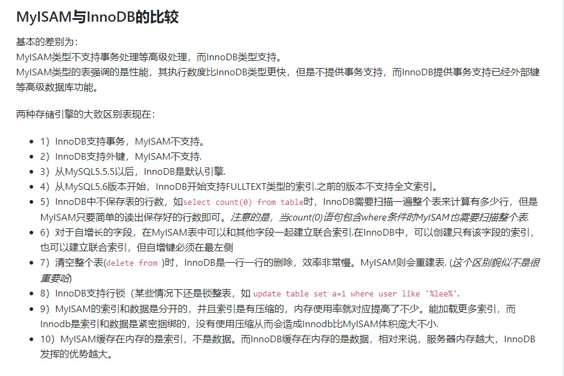

# 后端面试

## 后端面试

## 基础 

### ★★★ 进程与线程的本质区别、以及各自的使用场景。

进程是资源（CPU、内存等）分配的基本单位，它是程序执行时的一个实例。创建进程，分配资源，放入进程就绪队列，进程调度器选中，分配CPU时间，真正运行。

线程是程序执行时的最小单位，它是进程的一个执行流，是CPU调度和分派的基本单位。一个进程可以由很多个线程组成，线程间共享进程的所有资源，每个线程有自己的堆栈和局部变量。线程由CPU独立调度执行，在多CPU环境下就允许多个线程同时运行。同样多线程也可以实现并发操作，每个请求分配一个线程来处理。

#### 进程与线程本质区别：

1. 调度：线程是调度和分配的基本单位 ，进程是资源拥有的基本单位 。同一进程的线程切换不会引起进程切换。
2. 拥有资源：进程都是拥有资源的一个独立单位，线程自己不拥有系统资源（只有一些必不可少的资源）。
3. 系统开销：创建或撤消进程时，系统都要分配或回收资源，进程系统开销远大于线程系统开销。进程切换也远大于线程切换的开销。
4. 通信：多进程间的数据共享就需要用到共享内存、信号量等IPC技术。线程间可以直接读写进程数据段（如全局变量）来进行通信（需要同步和互斥手段辅助），线程的数据同步要比进程略复杂。

#### 各自的使用场景：

1. 需要频繁创建销毁的优先使用线程，因为对进程来说创建和销毁一个进程代价是很大的。
2. 线程的切换速度快，所以在需要大量计算，切换频繁时用线程，还有耗时的操作使用线程可提高应用程序的响应。
3. 因为对CPU系统的效率使用上线程更占优，所以可能要发展到多机分布的用进程，多核分布用线程。
4. 并行操作时使用线程，如C/S架构的服务器端并发线程响应用户的请求。
5. 需要更稳定安全时，适合选择进程；需要速度时，选择线程更好。

#### 多进程优点： <a id="-"></a>

1. 编程相对容易：通常不需要考虑锁和同步资源的问题。
2. 更强的容错性：比起多线程的一个好处是一个进程崩溃了不会影响其他进程。
3. 有内核保证的隔离：数据和错误隔离。
4. 对于使用如C/C++这些语言编写的本地代码，错误隔离是非常有用的：采用多进程架构的程序一般可以做到一定程度的自恢复（master守护进程监控所有worker进程，发现进程挂掉后将其重启）

#### 多进程的使用场景： <a id="-"></a>

1. nginx主流的工作模式是多进程模式（也支持多线程模型）
2. 几乎所有的web server服务器服务都有多进程的，至少有一个守护进程配合一个worker进程，例如apached,httpd等等以d结尾的进程包括init.d本身就是0级总进程，所有你认知的进程都是它的子进程； chrome浏览器也是多进程方式。
3. redis也可以归类到“多进程单线程”模型（平时工作是单个进程，涉及到耗时操作如持久化或aof重写时会用到多个进程）

#### 多线程优点：

1. 创建速度快，较轻地上下文切换开销，不用切换地址空间，不用更改寄存器，不用刷新TLB
2. 方便高效地数据共享，多线程间可以共享同一虚拟地址空间
3. 如果全都是计算任务，但每个任务的耗时不都为1s，而是1ms-1s之间波动，多线程相比多进程的优势就体现出来，它能有效降低“简单任务被复杂任务压住”的概率；

#### 多进程的使用场景： <a id="-"></a>

1. 桌面软件，响应用户输入的是一个线程，后台程序处理是另外的线程
2. 根据工作集（需要共享的内存）的大小来定。如果工作集较大，就用多线程，避免cpu cache频繁的换入换出。比如memcached。

### ★☆☆ 进程状态。 

* 就绪状态：进程已获得除处理机以外的所需资源，等待分配处理机资源
* 运行状态：占用处理机资源运行，处于此状态的进程数小于等于CPU数
* 阻塞状态： 进程等待某种条件，在条件满足之前无法执行

操作系统为了控制进程的执行，必须有能力挂起正在CPU上运行的进程，并恢复以前挂起的某个进程的执行，这种行为被称为进程切换，任务切换或上下文切换。

### ★★★ 进程调度算法的特点以及使用场景。 

1. **时间片轮转调度算法**（RR）：根据进程**到达的先后顺序**让进程在**固定地单位时间片**内执行，执行完成后便调度下一个进程执行，时间片轮转调度不考虑进程等待时间和执行时间，属于抢占式调度。**优点**是兼顾长短作业，**缺点**是平均等待时间较长，上下文切换较费时。适用于分时系统。
2. **先来先服务调度算法**（FCFS）：根据进程**到达的先后顺序执行进程**，不考虑等待时间和执行时间，会产生饥饿现象。属于非抢占式调度，优点是公平，实现简单；缺点是不利于短作业。
3. **优先级调度算法**（HPF）：在进程等待队列中选择优先级最高的来执行。常被用于批处理系统中，还可用于实时系统中。
4. **多级反馈队列调度算法**：将**时间片轮转与优先级调度相结合**，把进程按优先级分成不同的队列，先按优先级调度，优先级相同的，按时间片轮转。优点是兼顾长短作业，有较好的响应时间，可行性强，适用于各种作业环境。
5. **高响应比优先调度算法**：根据`响应比=（进程执行时间+进程等待时间）/ 进程执行时间`这个公式得到的响应比来进行调度。高响应比优先算法在等待时间相同的情况下，作业执行的时间越短，响应比越高，满足段任务优先，同时响应比会随着等待时间增加而变大，优先级会提高，能够避免饥饿现象。优点是兼顾长短作业，缺点是计算响应比开销大，适用于批处理系统。

### ★☆☆ 线程实现的方式。 

| 名称 | 描述 |
| :--- | :--- |
| 用户级线程\(User-Level Thread, ULT\) | 由应用程序所支持的线程实现, 对内核不可见 |
| 内核级线程\(Kernel-Level Thread, KLT\) | 内核级线程又称为内核支持的线程 |
| 组合线程\(Hybrid Multithreading\) | 用户级线程和内核级线程组合 |

### ★★☆ 协程的作用。 

协程是一种用户态的轻量级线程，拥有自己的寄存器上下文和栈。切换时，寄存器上下文和栈保存到其他地方，切回来时，恢复先前保存的寄存器上下文和栈。即进入上一次离开时所处逻辑流的位置。（Python使用generator机制，greenlet使用汇编控制对程序指向来实现）。在单进程单线程任务中的交互，才有它的用武之地。高并发+高扩展性+低成本：一个CPU支持上万的协程都不是问题。所以很适合用于高并发处理。

#### 作用：

1. 线程和协程推荐在IO密集型的任务\(比如网络调用\)中使用，而在CPU密集型的任务中，表现较差。
2. 对于CPU密集型的任务，则需要多个进程，绕开GIL的限制，利用所有可用的CPU核心，提高效率。
3. 所以大并发下的最佳实践就是多进程+协程，既充分利用多核，又充分发挥协程的高效率，可获得极高的性能。

#### 协程的优点：

1. 无需线程上下文切换的开销
2. 无需锁定及同步的开销
3. 方便切换控制流，简化编程模型

#### 协程的缺点：

1. 无法利用多核资源：协程的本质是个单线程，它不能同时将单个CPU 的多个核用上，协程需要和进程配合才能运行在多CPU上。当然我们日常所编写的绝大部分应用都没有这个必要，除非是cpu密集型应用。
2. 进行阻塞（Blocking）操作（如IO时）会阻塞掉整个程序，一个协程调用了阻塞式I/0，由于是用户主动调用协程切换功能，不是系统强制执行的，所以当一个协程调用了阻塞I/0，就没有机会调用切换功能。正确的做法是新建一个线程或者从线程池中分配一个线程，在这个线程中执行需要的阻塞式操作，同时将当前协程休眠（让出执行权），在新线程中的操作完成后，再唤醒协程。

### ★★☆ 常见进程同步问题。 

####  生产者-消费者（三个信号量）

1. 当缓冲区满的时候，生产者会进入休眠状态，当下次消费者开始消耗缓冲区的数据时，生产者才会被唤醒，开始往缓冲区中添加数据；
2. 当缓冲区空的时候，消费者也会进入休眠状态，直到生产者往缓冲区中添加数据时才会被唤醒。

empty：缓冲区 空闲 资源数 

full：缓冲区，已满 资源数： 保证不会空时消费，满时生产（保证顺序、同步） 

mutex 代表互斥锁 ： 保证同一时间只有一个线程可以访问共享资源（互斥访问）

####  读者-写者问题 （可以多个进程同时读，但是写时就只能有一个写）

1. 多个读者都可以同时并发阅读，只要有一个读者，写着不可以进行更新。
2. 可以有多个写着，但是同一时间只有一个写者可以更新，这时候所有读者都等待写着完成后才能进行阅读。

wmutex： 互斥的写 （写时不能读，只能一个写） 

rmutex： 互斥的使用readcount（对readcount加锁） 

readcount： 统计读进程数目，及读者数量（临界资源，多个读进程共享）

####  哲学家进餐问题 （只允许同时拿起左右两边的筷子）

mutex: 互斥量，对拿起左右两只筷子加锁（只有一个进程能访问）

### ★★★ 进程通信方法的特点以及使用场景。

#### 共享内存（inter-process communication）

共享内存是指多个进程共享一块内存，是专门用来解决不同进程之间的通信问题的，由于是直接对内存进行数据传输操作，所以是速度最快的IPC（inter-process communication）方式，因为是共享内存，所以需要配合信号量机制实现同步。

#### 管道（pipe）

无名管道\( pipe \)：管道是一种半双工的通信方式，数据只能单向流动，而且只能在具有亲缘关系的进程间使用。进程的亲缘关系通常是指父子进程关系。

高级管道\(popen\)：将另一个程序当做一个新的进程在当前程序进程中启动，则它算是当前程序的子进程，这种方式我们成为高级管道方式。

有名管道 \(named pipe\) ： 有名管道也是半双工的通信方式，但是它允许无亲缘关系进程间的通信。

当一个管道建立时，它会创建两个文件描述符：`fd[0]`为读而打开，`fd[1]`为写而打开。


#### 消息队列（message queue） 

消息队列\( message queue \) ： 消息队列是由消息的链表，存放在内核中并由消息队列标识符标识。消息队列克服了信号传递信息少、管道只能承载无格式字节流以及缓冲区大小受限等缺点。

#### 套接字（socket）

套接字\( socket \) ： 套解口也是一种进程间通信机制，与其他通信机制不同的是，它可用于不同机器间的进程通信。

#### 使用场景：

1. 数据传输：一个进程需要将它的数据发送给另一个进程;
2. 资源共享：多个进程间共享同样的资源
3. 通知事件：一个进程需要向另一个或一组进程发送消息，通知发生了某种事件
4. 进程控制：有些进程希望完全控制另一个进程的执行（如debug进程），该控制进程希望能够拦截另一个进程的所有操作，并能够及时知道它的状态改变。

### ★★★ 死锁必要条件、解决死锁策略，能写出和分析死锁的代码，能说明在数据库管理系统或者 Java 中如何解决死锁。 

#### 必要条件：

互斥条件（Mutual exclusion）：资源不能被共享，只能由一个进程使用。 

请求与保持条件（Hold and wait）：已经得到资源的进程可以再次申请新的资源。 

不可剥夺剥夺条件（No pre-emption）：已经分配的资源不能从相应的进程中被强制地剥夺。 

环路等待条件（Circular wait）：系统中若干进程组成环路，该环路中每个进程都在等待相邻进程正占用的资源。

#### 解决策略：

死锁预防：预先静态分配法：破坏了“不可剥夺条件”，资源有序分配法：破坏了“环路条件”

死锁避免：设法破坏4个必要条件之一，严格防止死锁的发生。银行家算法：若发现分配资源后进入不安全状态，则不予分配；若扔处于安全状态，则实施分配。

死锁检测：允许死锁产生，定时地运行一个死锁检测程序，判断系统是否发生死锁。

死锁解除：资源剥夺法，撤销进程法

### ★★★ 虚拟内存的作用，分页系统实现虚拟内存原理。 

虚拟内存是计算机系统内存管理的一种技术。它使得应用程序认为它拥有连续可用的内存（一个连续完整的地址空间），而实际上，它通常是被分隔成多个物理内存碎片，还有部分暂时存储在外部磁盘存储器上，在需要时进行数据交换。 

虚拟地址被分成虚拟页号（高地址）和偏移量（低地址）两部分。不同的划分对应了不同的页面大小。

 虚拟页号可作为页表的索引，以找到该虚拟页面对应的页表项。由页表项可以找到对应的页框。然后把页框号拼接到偏移量的高位端，以替换调虚拟页号，形成送往内存的物理地址。 

### ★★★ 页面置换算法的原理，特别是 LRU 的实现原理，最好能手写，再说明它在 Redis 等作为缓存置换算法。 

LRU（Least recently used，最近最少使用）根据数据的历史访问记录来进行淘汰数据，其核心思想是“如果数据最近被访问过，那么将来被访问的几率也更高”。

基本思路

1. 新数据插入到列表头部；
2. 每当缓存命中（即缓存数据被访问），则将数据移到列表头部；
3. 当列表满的时候，将列表尾部的数据丢弃。

```python
class DLinkedNode:
    def __init__(self, key=0, value=0):
        self.key = key
        self.value = value
        self.prev = None
        self.next = None


class LRUCache:

    def __init__(self, capacity: int):
        self.cache = dict()
        # 使用伪头部和伪尾部节点    
        self.head = DLinkedNode()
        self.tail = DLinkedNode()
        self.head.next = self.tail
        self.tail.prev = self.head
        self.capacity = capacity
        self.size = 0

    def get(self, key: int) -> int:
        if key not in self.cache:
            return -1
        # 如果 key 存在，先通过哈希表定位，再移到头部
        node = self.cache[key]
        self.moveToHead(node)
        return node.value

    def put(self, key: int, value: int) -> None:
        if key not in self.cache:
            # 如果 key 不存在，创建一个新的节点
            node = DLinkedNode(key, value)
            # 添加进哈希表
            self.cache[key] = node
            # 添加至双向链表的头部
            self.addToHead(node)
            self.size += 1
            if self.size > self.capacity:
                # 如果超出容量，删除双向链表的尾部节点
                removed = self.removeTail()
                # 删除哈希表中对应的项
                self.cache.pop(removed.key)
                self.size -= 1
        else:
            # 如果 key 存在，先通过哈希表定位，再修改 value，并移到头部
            node = self.cache[key]
            node.value = value
            self.moveToHead(node)
    
    def addToHead(self, node):
        node.prev = self.head
        node.next = self.head.next
        self.head.next.prev = node
        self.head.next = node
    
    def removeNode(self, node):
        node.prev.next = node.next
        node.next.prev = node.prev

    def moveToHead(self, node):
        self.removeNode(node)
        self.addToHead(node)

    def removeTail(self):
        node = self.tail.prev
        self.removeNode(node)
        return node
```

### ★★★ 比较分页与分段的区别。 

1. 页是信息的物理单位，实现离散分配，消减内存零头，提高内存利用率，是系统管理的需要。段是信息的逻辑单位，分段的目的是为了能更好地满足用户的需要
2. 页的大小固定，由系统把逻辑地址划分为页号和页内地址两部分。段的长度却不固定，决定于用户所编写的程序。
3. 分页的作业地址空间是一维，单一的线性地址空间，分段的作业地址空间是二维，给出段名，又需给出段内地址。

### ★★★ 分析静态链接的不足，以及动态链接的特点。

1. 静态链接库优点：代码装载速度快，执行速度略比动态链接库快。只需保证在开发者的计算机中有正确的.LIB文件，在以二进制形式发布程序时不需考虑在用户的计算机上.LIB文件是否存在及版本问题，可避免DLL地狱等问题。
2. 动态链接库的优点： 更加节省内存并减少页面交换。DLL文件与EXE文件独立，只要输出接口不变（即名称、参数、返回值类型和调用约定不变），更换DLL文件不会对EXE文件造成任何影响，因而极大地提高了可维护性和可扩展性。不同编程语言编写的程序只要按照函数调用约定就可以调用同一个DLL函数。适用于大规模的软件开发，使开发过程独立、耦合度小，便于不同开发者和开发组织之间进行开发和测试。
3. 不足之处：使用静态链接生成的可执行文件体积较大，包含相同的公共代码，造成浪费。使用动态链接库的应用程序不是自完备的，它依赖的DLL模块也要存在，如果使用载入时动态链接，程序启动时发现DLL不存在，系统将终止程序并给出错误信息。而使用运行时动态链接，系统不会终止，但由于DLL中的导出函数不可用，程序会加载失败；速度比静态链接慢。当某个模块更新后，如果新模块与旧的模块不兼容，那么那些需要该模块才能运行的软件，统统撕掉。这在早期Windows中很常见。

## Linux

### ★★☆ 文件系统的原理，特别是 inode 和 block。数据恢复原理。 

磁盘要分区，然后格式化，创建文件系统。

在每个linux存储设备或存储设备的分区被格式化为ext4文件系统后，一般都有两部分：

**第一部分是INode**。inode包含的属性信息包括文件大小、属性、归属的用户组，读写权限、文件类型、修改时间，还包含指向文件实体的指针的功能。（文件名不属于文件的属性，inode不包含文件名）

**第二部分是block**。Block用来存储实际数据的，例如照片，视频等普通文件数据。

**数据恢复原理**：删除的数据并没有被删除，只是标记为此处空闲，可以写入数据。

### ★★★ 硬链接与软链接的区别。


###  ★★☆ 能够使用常用的命令，比如 cat 文件内容查看、find 搜索文件，以及 cut、sort 等管线命令。了解 grep 和 awk 的作用。 

cat 文件名 查看文件内容内容 -n 列出行号

find 查找位置 -name 文件名

grep 主要用于搜索某些字符串 sed，awk 用于处理文本

### ★★★ 僵尸进程与孤儿进程的区别，从 SIGCHLD 分析产生僵尸进程的原因。

 **僵尸进程：**一个子进程在其父进程还没有来得及调用wait\(\)或waitpid\(\)来获取子进程的信号状态的情况下退出，那么这个子进程就是僵尸进程。子进程结束后会向父进程发出SIGCHLD信号。  
  
**孤儿进程：**一个父进程退出，而它的一个或多个子进程还在运行，那么那些子进程将成为孤儿进程。孤儿进程将被init进程\(进程号为1\)所收养，并由init进程对它们完成状态收集工作。  


## 网络基础

### ★★★ 各层协议的作用，以及 TCP/IP 协议的特点。 


### ★★☆ 以太网的特点，以及帧结构。 

### ★★☆ 集线器、交换机、路由器的作用，以及所属的网络层。 

### ★★☆ IP 数据数据报常见字段的作用。 

### ★☆☆ ARP 协议的作用，以及维护 ARP 缓存的过程。 

### ★★☆ ICMP 报文种类以及作用；和 IP 数据报的关系；Ping 和 Traceroute 的具体原理。 

### ★★★ UDP 与 TCP 比较，分析上层协议应该使用 UDP 还是 TCP。 

1）TCP 是面向连接的传输。UDP 是无连接的传输

2）TCP 有流量控制、拥塞控制，检验数据数据按序到达，而 UDP 则相反。

3）TCP 的路由选择只发生在建立连接的时候，而 UDP 的每个报文都要进行路由选择

4）TCP 是可靠性传输，他的可靠性是由超时重发机制实现的，而 UDP则是不可靠传输

5）UDP 因为少了很多控制信息，所以传输速度比 TCP 速度快

6）TCP 适合用于传输大量数据，UDP 适合用于传输小量数据  
  
数据丢失，某些应用（例如audio）可以容忍某种程度上的数据丢失；而其他应用 （例如文件传输、telnet）要求100%可靠的数据传输。微信视频聊天是UDP，信息是TCP

实时性，某些应用（例如IP电话、交互式游戏等）要求较低的时延。

带宽，某些应用（例如多媒体）对最低带宽有要求；而其他应用（“弹性应用”）则可灵活应用所能得到的带宽。


### ★★★ 理解三次握手以及四次挥手具体过程，三次握手的原因、四次挥手原因、TIME\_WAIT 的作用。 

**三次握手**

第一次握手：客户端给服务端发一个 SYN 报文，并指明客户端的初始化序列号a。

第二次握手：服务器收到客户端的 SYN 报文之后，会以自己的 SYN 报文作为应答，并且也是指定了自己的初始化序列号 b。同时会把客户端的 a +1 作为ACK 的值

第三次握手：客户端收到 SYN 报文之后，会发送一个 ACK 报文，当然，也是一样把服务器的 b + 1 作为 ACK 的值，表示已经收到了服务端的 SYN 报文

在socket编程中，客户端执行connect\(\)时，将触发三次握手。

 **为什么需要三次握手，两次不行吗？**

如客户端发出连接请求，但因连接请求报文丢失而未收到确认，于是客户端再重传一次连接请求。后来收到了确认，建立了连接。数据传输完毕后，就释放了连接，客户端共发出了两个连接请求报文段，其中第一个丢失，第二个到达了服务端，但是第一个丢失的报文段只是在某些网络结点长时间滞留了，延误到连接释放以后的某个时间才到达服务端，此时服务端误认为客户端又发出一次新的连接请求，于是就向客户端发出确认报文段，同意建立连接，不采用三次握手，只要服务端发出确认，就建立新的连接了，此时客户端忽略服务端发来的确认，也不发送数据，则服务端一致等待客户端发送数据，浪费资源。

**四次挥手**

_注意: 中断连接端可以是客户端，也可以是服务器端. 下面仅以客户端断开连接举例, 反之亦然._

1. 客户端发送一个数据分段, 其中的 FIN 标记设置为1. 客户端进入 FIN-WAIT 状态. 该状态下客户端只接收数据, 不再发送数据.
2. 服务器接收到带有 FIN = 1 的数据分段, 发送带有 ACK = 1 的剩余数据分段, 确认收到客户端发来的 FIN 信息.
3. 服务器等到所有数据传输结束, 向客户端发送一个带有 FIN = 1 的数据分段, 并进入 CLOSE-WAIT 状态, 等待客户端发来带有 ACK = 1 的确认报文.
4. 客户端收到服务器发来带有 FIN = 1 的报文, 返回 ACK = 1 的报文确认, 为了防止服务器端未收到需要重发, 进入 TIME-WAIT 状态. 服务器接收到报文后关闭连接. 客户端等待 2MSL 后未收到回复, 则认为服务器成功关闭, 客户端关闭连接.

 **挥手为什么需要四次？**

因为当服务端收到客户端的SYN连接请求报文后，可以直接发送SYN+ACK报文。其中ACK报文是用来应答的，SYN报文是用来同步的。但是关闭连接时，当服务端收到FIN报文时，很可能并不会立即关闭SOCKET，所以只能先回复一个ACK报文，告诉客户端，“你发的FIN报文我收到了”。只有等到我服务端所有的报文都发送完了，我才能发送FIN报文，因此不能一起发送。故需要四次挥手。

**TIME\_WAIT 的作用**

* 保证客户端发送的最后一个ACK报文段能够到达服务端。

这个ACK报文段有可能丢失，使得处于LAST-ACK状态的B收不到对已发送的FIN+ACK报文段的确认，服务端超时重传FIN+ACK报文段，而客户端能在2MSL时间内收到这个重传的FIN+ACK报文段，接着客户端重传一次确认，重新启动2MSL计时器，最后客户端和服务端都进入到CLOSED状态，若客户端在TIME-WAIT状态不等待一段时间，而是发送完ACK报文段后立即释放连接，则无法收到服务端重传的FIN+ACK报文段，所以不会再发送一次确认报文段，则服务端无法正常进入到CLOSED状态。

* 防止“已失效的连接请求报文段”出现在本连接中。

客户端在发送完最后一个ACK报文段后，再经过2MSL，就可以使本连接持续的时间内所产生的所有报文段都从网络中消失，使下一个新的连接中不会出现这种旧的连接请求报文段。  


### ★★★ 可靠传输原理，并设计可靠 UDP 协议。 

可靠传输的原理

实现可靠传输一般有两种途径，一是基于ARQ（Automatic Repeat reQuest）的确认和重传机制，二是使用前向纠错（FEC）。

FEC是纠删码在通信中的应用，一般在链路层用的比较多，特别是无线通信中（包括WiFi，移动通信、卫星通信等）。可靠UDP传输主要还是依靠重传机制，个别协议会用FEC作为辅助手段，所以本文中主要介绍重传相关的技术。

#### ARQ

ARQ包括停等式、回退N帧、选择重传等机制。由于停等式的效率太低，TCP和可靠UDP协议一般使用的是基于回退N帧机制和滑动窗口协议的连续式ARQ，TCP后来也引入了SACK，以提高性能。

### ★★☆ TCP 拥塞控制的作用，理解具体原理。 

#### 拥塞算法

TCP早期没有拥塞控制，直到1986年由于拥塞导致网络瘫痪，所以拥塞控制被引入到TCP中。拥塞算法主要是计算和调整接收窗口、发送窗口、拥塞窗口的大小，从而控制传输速度，既充分利用带宽，又避免网络出现拥塞。

最早的拥塞算法是Tahoe，后来的改进版有Reno、NewReno、BIC、CUBIC等。Linux在2.6.8之前使用的是Reno/NewReno，2.6.8到2.6.18之间使用BIC，2.6.19开始使用CUBIC。

拥塞算法的核心机制有：

* 慢启动

在连接刚建立时接收窗口以指数方式增加，直到达到慢启动的阀值，或者是遇到丢包，开始进入拥塞回避阶段。

* 拥塞回避

在此阶段会使用AIMD\(Additive Increase Multiplicative Decrease\)方式调整窗口大小，通过线性增加和指数衰减，逐渐逼近和收敛到一个理想值，从而达到充分利用带宽但又不引起拥塞的状态。

* 快重传

发送方如果收到连续3次重复的ACK确认，就认为出现了丢包，而不需要等到重传计时器超时。这样可以更早的检测到丢包，提高算法效率。

* 快恢复

Tahoe检测到丢包后，会回到初始状态，然后进入慢启动阶段，导致传输效率太低。Reno对此作了改进，在检测到丢包后，直接进入拥塞回避阶段，将窗口大小调整为原来的一半，避免了慢启动的开销。

#### 拥塞算法分类

TCP的拥塞算法有很多种，按照拥塞检测的机制，可以分为三类：

* 基于丢包

路由器和交换机在要转发的报文超过负载时会丢弃部分报文，所以丢包可以作为网络出现拥塞的一个标志，这也是TCP中主流的拥塞检测机制。从最早的Tahoe和改进版的Reno、NewReno、HSTCP、STCP、BIC、CUBIC等，都是基于丢包的，也是主流的拥塞检测机制。

* 基于延时

现在的路由器和交换机的缓存比较大，对于超出负载的报文会先缓存起来，而不是立即丢弃。直到负载超过缓存大小，才会丢弃报文。所以当网络出现拥塞时，并不是马上丢包，而有报文丢失时，网络的拥塞已经比较严重。这样，前面基于丢包的拥塞检测机制就不够准确，于是，就有了基于延时的检测算法。

虽然这类算法可以更早的检测出拥塞，使得整个网络更有效率，但在跟基于丢包的算法竞争时，却由于过早的避让，导致性能较差，无法保证算法的公平性，所以影响了它们的应用。

这类的算法有Vegas和Fast TCP，其中Fast TCP是一种商业方案，有专利保护，在一些单边加速的场景中有应用。Vegas由于公平性的问题，没有被广泛使用。

Google新推出的BBR算法，虽然也可以归为基于延时类的，但跟传统算法有较大区别。传统算法通过AIMD来逼近理想传输速度，效率较低，而且受丢包和抖动的影响较大。BBR通过RTT和带宽乘积\(BDP\)来作为调整发送窗口的基础，避免了这些问题，从而提高性能和避免拥塞。

* 显式拥塞通知（Explicit Congestion Notification）

通过IP头中2个bit的ECN标识和TCP头中的ECN-Echo位，可以在各节点以及中间设备之间显式的传递拥塞信号，从而达到避免拥塞的目的。不过由于一些终端和中间设备（路由器、交换机、网关等）并不支持ECN，导致ECN并没有广泛应用。

### ★★☆ DNS 的端口号；TCP 还是 UDP；作为缓存、负载均衡。

dns 所用的端口号是：53 UDP

利用dns实现服务器的负载均衡 1.其原理很简单，就是在配置文件中多添加一条记录 比如两台web服务器ip分别是202.106.1.11 202.106.1.12，那么要实现两台web服务器的负载均衡就可以添加

## HTTP

### ★★★ GET 与 POST 比较：作用、参数、安全性、幂等性、可缓存。 

GET

1.GET是通过URL提交数据，因此GET可提交的数据量就跟URL所能达到的最大长度有直接关系。

2.实际上HTTP协议对URL长度是没有限制的；限制URL长度大多数是浏览器或者服务器的配置参数

POST

1.同样的，HTTP协议没有对POST进行任何限制，一般是受服务器配置限制或者内存大小。

2.PHP下可以修改php.conf的postmaxsize来设置POST的大小。

**请求header的content-length问题**

如果有人恶意伪造content-length很大的包头，但实际上发送content-length很小的请求，这样服务器会一直干等，直到超时。当然服务器是可以通过设置来避免该问题的

**GET和POST的安全性**

1.GET是通过URL方式请求，可以直接看到，明文传输。

2.POST是通过请求header请求，可以开发者工具或者抓包可以看到，同样也是明文的。 

3.GET请求会保存在浏览器历史纪录中，还可能会保存在Web的日志中。

**GET和POST对服务器的状态**

根据http的设计，大家在看到get的时候，都期望这个请求对服务器没有修改，看到post的时候，都认为这对服务器产生了修改。

**GET幂等，POST不幂等**

幂等是指同一个请求方法执行多次和仅执行一次的效果完全相同。

1.按照RFC规范，PUT，DELETE和安全方法都是幂等的。虽说是规范，但服务端实现是否幂等是无法确保的。

2.引入幂等主要是为了处理同一个请求重复发送的情况，比如在请求响应前失去连接，如果方法是幂等的，就可以放心地重发一次请求。这也是浏览器在后退/刷新时遇到POST会给用户提示的原因：POST语义不是幂等的，重复请求可能会带来意想不到的后果。

3.比如在微博这个场景里，GET的语义会被用在「看看我的Timeline上最新的20条微博」这样的场景，而POST的语义会被用在「发微博、评论、点赞」这样的场景中。

### ★★☆ HTTP 状态码。 

| 分类 | 分类描述 |
| :--- | :--- |
| 1\*\* | 信息，服务器收到请求，需要请求者继续执行操作 |
| 2\*\* | 成功，操作被成功接收并处理 |
| 3\*\* | 重定向，需要进一步的操作以完成请求 |
| 4\*\* | 客户端错误，请求包含语法错误或无法完成请求 |
| 5\*\* | 服务器错误，服务器在处理请求的过程中发生了错误 |

常见HTTP状态码

| 状态码 | 说明 |
| :--- | :--- |
| 200 | 请求成功 |
| 307 | 重定向 |
| 400 | 错误的请求，请求地址或者参数有误 |
| 404 | 请求资源在服务器不存在 |
| 500 | 服务器内部源代码出现错误 |

### ★★★ Cookie 作用、安全性问题、和 Session 的比较。 

Session是在服务端保存的一个数据结构，用来跟踪用户的状态，这个数据可以保存在集群、数据库、文件中。Session 的运行依赖Session ID，而 Session ID 是存在 Cookie 中的。

Cookie是客户端保存用户信息的一种机制，用来记录用户的一些信息，也是实现Session的一种方式。

### ★★☆ 缓存 的 Cache-Control 字段，特别是 Expires 和 max-age 的区别。ETag 验证原理。 

####  Cache-Control

可缓存性  
public：http请求返回的过程当中，在cache-control中设置这个值，代表http请求返回的内容所经过的任何路径当中（包括中间一些http代理服务器以及发出请求的客户端浏览器），都可以对返回内容进行缓存操作。  
private：代表只有发起请求的浏览器才可以进行缓存。  
no-cache：可以在本地进行缓存，但每次发请求时，都要向服务器进行验证，如果服务器允许，才能使用本地缓存。  
no-store：本地和代理服务器都不可以存储缓存，每次都要重新请求，拿到内容。  
no-transform：主要是用在proxy服务器，不允许进行格式转换。

#### max-age和Expires

浏览器会先检查缓存是否过期，如果没过期，干脆就不向服务端发起请求，直接使用本地缓存，这叫做“缓存命中”。  
max-age：最大缓存时间  
Expires：有效期  
_这两个同时存在时，max-age优先生效_

#### Etag和Last-Modified

如果没有上一节的两个标签，或者验证失败，则浏览器向服务器发起请求，浏览器通过Etag或Last-Modified判断浏览器缓存的内容是否过期。如果没过期返回304，这叫做“缓存再验证成功”，浏览器更新本地缓存的max-age和Expires，并且使用本地缓存；如果过期了，这叫做“缓存再验证失败（缓存未命中）”，则返回新的数据。  
Etag：被请求变量的实体标记（与客户端请求头 If-None-Match对应）  
Last-Modified：被请求变量的最后修改时间（与客户端请求头If-Modified-Since对应）  
_如果两者都有，就必须同时验证，并且两者都满足才会返回304_

### ★★★ 长连接与短连接原理以及使用场景，流水线。 


**短连接**  
连接-&gt;传输数据-&gt;关闭连接  
比如HTTP是无状态的的短链接，浏览器和服务器每进行一次HTTP操作，就建立一次连接，但任务结束就中断连接。  
具体就是 浏览器client发起并建立TCP连接 -&gt; client发送HttpRequest报文 -&gt; server接收到报文-&gt;server handle并发送HttpResponse报文给前端,发送完毕之后立即调用socket.close方法-&gt;client接收response报文-&gt;client最终会收到server端断开TCP连接的信号-&gt;client 端断开TCP连接，具体就是调用close方法。

也可以这样说：短连接是指SOCKET连接后，发送接收完数据后马上断开连接。  
因为连接后接收了数据就断开了，所以每次数据接受处理不会有联系。 这也是HTTP协议无状态的原因之一。

**长连接**  
连接-&gt;传输数据-&gt;保持连接 -&gt; 传输数据-&gt; ...........-&gt;直到一方关闭连接，多是客户端关闭连接。  
长连接指建立SOCKET连接后不管是否使用都保持连接，但安全性较差。

**HTTP在短链接和长连接上的选择：**

HTTP是无状态的 ，也就是说，浏览器和服务器每进行一次HTTP操作，就建立一次连接，但任务结束就中断连接。如果客户端浏览器访问的某个HTML或其他类型的 Web页中包含有其他的Web资源，如JavaScript文件、图像文件、CSS文件等；当浏览器每遇到这样一个Web资源，就会建立一个HTTP会话

HTTP1.1和HTTP1.0相比较而言，最大的区别就是增加了持久连接支持\(貌似最新的HTTP1.1 可以显示的指定 keep-alive\),但还是无状态的，或者说是不可以信任的。  
如果浏览器或者服务器在其头信息加入了这行代码 Connection:keep-alive  
TCP连接在发送后将仍然保持打开状态，于是，浏览器可以继续通过相同的连接发送请求。保持连接节省了为每个请求建立新连接所需的时间，还节约了带宽。  
实现长连接要客户端和服务端都支持长连接。

**什么时候用长连接，短连接？**  
长连接多用于操作频繁，点对点的通讯，而且连接数不能太多情况，。每个TCP连接都需要三步握手，这需要时间，如果每个操作都是先连接，再操作的话那么处理速度会降低很多，所以每个操作完后都不断开，次处理时直接发送数据包就OK了，不用建立TCP连接。例如：数据库的连接用长连接， 如果用短连接频繁的通信会造成socket错误，而且频繁的socket 创建也是对资源的浪费。

而像WEB网站的http服务一般都用短链接，因为长连接对于服务端来说会耗费一定的资源，而像WEB网站这么频繁的成千上万甚至上亿客户端的连接用短连接会更省一些资源，如果用长连接，而且同时有成千上万的用户，如果每个用户都占用一个连接的话，那可想而知吧。所以并发量大，但每个用户无需频繁操作情况下需用短连好。

总之，长连接和短连接的选择要视情况而定。具体网络中的应用的话：  
http 1.0一般就指短连接，smtp,pop3,telnet这种就可以认为是长连接。一般的网络游戏应用都是长连接

### ★★★ HTTP 存在的安全性问题，以及 HTTPs 的加密、认证和完整性保护作用。 

HTTP的缺点

**1、通信使用明文（不加密），内容可能会被窃听**

因为按照TCP/IP的工作机制，通信内容在通信线路上有可能遭到窥视。即使是经过加密处理的通信，也会被窥探到通信内容，只是无法破解报文信息的含义。

有两种加密方式：

* 通信加密。用SSL建立安全通信路线，服务端和客户端就可以在安全的通信路线上开始通信。
* 通信内容加密。报文首部不加密，报文主体加密。

**2、不验证通信方的身份，可能遭遇伪装**

任何人都可以发送请求，服务器也都会响应。因此会存在以下隐患：

* 无法确定请求发送至目标的服务器是否是伪装的服务器
* 无法确定响应返回到的客户端是否是伪装的客户端
* 无法确定正在通信的双方是否具备访问权限
* 无法确定请求出自何方
* 即使是无意义的请求也会全部接收，会出现DoS攻击

SSL有一种被称为**证书**的手段可以用于确定通信方（服务器和客户端）。

**3、无法证明报文的完整性，可能遭遇篡改**

HTTP协议无法保证通信的报文的完整性。即没有任何办法确认发出的响应/请求和接收到的响应/请求是前后相同的。在传输途中遇中间者拦截并篡改内容的叫**中间人攻击（MITM）**。  
可用MD5和SHA-1等**散列值校验**的方法以及确认文件的**数字签名方法**（以PGP创建的数字签名为例）来保证报文的完整性，但是当PGP和MD5本身被篡改时，报文的完整性依旧无法保证。

HTTPS=HTTP+加密+认证+完整性保护

HTTPS是身披SSL外壳的HTTP。  
HTTPS只是HTTP的通信接口部分用SSL和TLS协议代替。  
通常HTTP直接和TCP通信，使用SSL之后变成了先和SSL通信再和TCP通信。

**HTTPS采用的是公开密钥和共享密钥两者并用的混合加密机制**

HTTPS是在**交换密钥**时利用**公开密钥**进行加密，**通信报文交换**利用**共享密钥**进行加密。因为公开密钥处理起来比较麻烦，效率较低。

**共享密钥**

加密和解密用**同一个密钥**的加密方式叫共享密钥加密，也叫对称密钥加密。以共享密钥加密必须要把共享密钥和加密的报文以取传给对方，如果加密的报文被攻击密钥也会被截获。

**公开密钥**

公开密钥加密使用**一对非对称密钥**。一把叫私有密钥，一把叫公开密钥。公开密钥是任何人都可以获得的，但是私有密钥是只有自己知道的。发送方利用**公开密钥进行加密**，接收方利用自己的**私有密钥进行解密**，就不需要担心密钥被盗走。  
SSL采用的是**公开密钥加密**的方式进行加密处理。存在**通信慢**和**CPU消耗大导致处理速度变慢**的问题。

**公开密钥存在的问题**

无法证明密钥本身就是货真价实的公开密钥。可以使用**数字证书认证机构**（CA）和其颁布的公开密钥证书确定该公开密钥是值得信赖的。

服务器会向CA提出公开密钥的申请，CA验证过服务器的身份后会对已申请的公开密钥做数字签名，然后将已签名的公开密钥放入密钥证书中绑定。服务器会将密钥证书发给客户端，从而进行以公开密钥加密的通信。

为什么不一直使用HTTPS

1、因为加密通信会消耗更多的CPU和资源内存  
2、减少证书购买的开销

### ★★☆ HTTP/1.x 的缺陷，以及 HTTP/2 的特点。 

**为什么要减少http请求**  
 这就要是要深入了解http1.x了

首先浏览器能够针对同一个域名能够发起的tcp请求是有限制的，像Chorme同时只支持发起6个tcp请求，意味着超过6个就有一些请求必须排队，这意味着请求会出现排队阻塞，而且虽然一个tcp连接可以发起多个请求但是如果其中某个请求很慢，还会让排队中的请求一起堵塞那么长时间。总结就是**请求连接数量有限然后请求会排队阻塞**

**同样原因的其他优化方法**

* 小图片内嵌在html中，以data base64格式存放图片。
* 把多个小的js文件合并成为一个大js文件,css也可以这样处理，不过这里要平缓，考虑缓存的问题，大文件里可能有些经常更新 有些不经常更新 要区别等待。

开始正式介绍http1.x的缺点

* 1.请求阻塞 如上已清晰说明
* 2.以明文文本字符串的形式传输内容，存在安全问题。
* 3.http 请求头无状态特性 导致传输效率低下  多个http请求头大部分信息是相同的，重复传输，导致宽带浪费.请求头多达几百字节，而请求主体却只有十几个字节，有效信息比很低。
* 4.只能浏览器主动请求响应，不能服务器主动推送信息过来

http2优势

**http2基于sdpy协议 ，专注于性能，目标是在用户和服务器间只用一个连接**  
 sdpy协议是google2009研发出来的，主要就是为了解决http1效率不高的问题

* 1.二进制帧数据  http2采用二进制进行数据传输，它把原来的header+body的数据格式拆分为一帧帧的二进制数据进行发送，而且收发都是无顺序的，这意味着不会出现堵塞。一帧帧数据上有个标识id,能够区分数据 ，浏览器可以据此组合出数据
* 2.header头数据压缩，和同一域名请求，只发送请求头不同的部分，这样就解决了http1中的问题 请求头过大而且重复发送
* 3.支持服务器端推送技术
* 4.传输内容加密  http2不强制加密，但是chrome firefox都公开宣布只支持加密的http2 所以实事上http2是加密的

http2缺点

主要是底层支持的tcp协议造成的问题

* tcp 以及tcp+tls建立连接延时，两个握手延时
* tcp队头阻塞

http2.0和http1.x的区别:

1. http1的解析是基于文本协议的各式解析,而http2.0的协议解析是二进制格式,更加的强大
2. **多路复用\(Mutiplexing\) :** 一个连接上可以有多个request,且可以随机的混在一起,每个不同的request都有对应的id,服务端可以通过request\_id来辨别,大大加快了传输速率
3. header压缩: http1.x中的header需要携带大量信息.而且每次都要重复发送.http2.0使用encode来减少传输的header大小.而且客户端和服务端可以各自缓存\(cache\)一份header filed表,避免了header的重复传输,还可以减少传输的大小.
4. 服务端推送\(server push\): 可以通过解析html中的依赖,智能地返回所需的其他文件\(css或者js等\),而不用再发起一次请求.

### ★★★ HTTP/1.1 的特性。 

**HTTP1.0和HTTP1.1的一些区别**

HTTP1.0最早在网页中使用是在1996年，那个时候只是使用一些较为简单的网页上和网络请求上，而HTTP1.1则在1999年才开始广泛应用于现在的各大浏览器网络请求中，同时HTTP1.1也是当前使用最为广泛的HTTP协议。 主要区别主要体现在：

1. **缓存处理**，在HTTP1.0中主要使用header里的If-Modified-Since,Expires来做为缓存判断的标准，HTTP1.1则引入了更多的缓存控制策略例如Entity tag，If-Unmodified-Since, If-Match, If-None-Match等更多可供选择的缓存头来控制缓存策略。
2. **带宽优化及网络连接的使用**，HTTP1.0中，存在一些浪费带宽的现象，例如客户端只是需要某个对象的一部分，而服务器却将整个对象送过来了，并且不支持断点续传功能，HTTP1.1则在请求头引入了range头域，它允许只请求资源的某个部分，即返回码是206（Partial Content），这样就方便了开发者自由的选择以便于充分利用带宽和连接。
3. **错误通知的管理**，在HTTP1.1中新增了24个错误状态响应码，如409（Conflict）表示请求的资源与资源的当前状态发生冲突；410（Gone）表示服务器上的某个资源被永久性的删除。
4. **Host头处理**，在HTTP1.0中认为每台服务器都绑定一个唯一的IP地址，因此，请求消息中的URL并没有传递主机名（hostname）。但随着虚拟主机技术的发展，在一台物理服务器上可以存在多个虚拟主机（Multi-homed Web Servers），并且它们共享一个IP地址。HTTP1.1的请求消息和响应消息都应支持Host头域，且请求消息中如果没有Host头域会报告一个错误（400 Bad Request）。
5. **长连接**，HTTP 1.1支持长连接（PersistentConnection）和请求的流水线（Pipelining）处理，在一个TCP连接上可以传送多个HTTP请求和响应，减少了建立和关闭连接的消耗和延迟，在HTTP1.1中默认开启Connection： keep-alive，一定程度上弥补了HTTP1.0每次请求都要创建连接的缺点。

### ★★☆ HTTP 与 FTP 的比较。


## Socket

### ★★☆ 五种 IO 模型的特点以及比较。 

1.阻塞式IO

* 使用系统调用，并一直阻塞知道内核将数据准备好，之后再由内核缓冲区复制到用户态，在等待内核准备的这段时间什么也干不了
* 特点：在I/O执行的两个阶段都被阻塞了--阻塞等待数据，阻塞拷贝数据
* 如图


2.非阻塞式IO

* 内核在没有准备好数据的时候会返回错误码，而调用程序不会休眠，而是不断轮询询问内核数据是否准备好
* 特点：在I/O执行的第一个阶段不会阻塞线程，但在第二阶段会阻塞
* 如图


3.IO多路复用

* 类似非阻塞，只不过轮询不是由用户线程去执行，而是由内核去轮询，内核监听程序监听到数据准备好后，调用内核函数复制数据到用户空间
* 特点：进行了两次系统调用，进程先是阻塞在select/poll上，再是阻塞在读操作的第二阶段上
* 如图


4. 信号驱动IO


* 使用该IO模型，需要开启套接字的信号驱动IO功能，并通过sigaction系统调用安装一个信号处理函数。sigaction函数立即返回，我们的进程继续工作，即进程没有被阻塞。当数据报准备好时，内核会为该进程产生一个SIGION信号，这样我们可以在信号处理函数中调用recvfrom读取数据报
* 特点：在等待数据ready期间进程不被阻塞，当收到信号通知时再阻塞并拷贝数据

5.异步IO


* 用户进程在发起aio\_read操作后，该系统调用立即返回--然后内核会自己等待数据ready，并且自动将数据拷贝到用户内存。整个过程完成以后，内核会给用户进程发送一个信号，通知IO操作完成
* 异步IO与信号驱动式IO的主要区别是：信号驱动IO是由内核通知我们何时启动一个IO操作，而异步IO是由内核通知我们IO操作何时完成。
* 特点：IO执行的两个阶段都由内核去完成，用户进程无需干预，也不会被阻塞。

**五种IO模型的比较：**


* 同步I/O操作：导致请求进程阻塞，直到I/O操作完成。
* 异步I/O操作：不导致请求进程阻塞。

综上：阻塞式IO、非阻塞式IO、信号驱动IO、IO复用都是同步IO模型。因为其中真正的IO操作将阻塞进程。

只有异步I/O模型属于POSIX定义的**异步I/O**，因为在异步I/O模型中，用户进程是将整个I/O操作都交给内核来完成，内核完成后发信号通知，在此期间用户进程完全不用去理会。

### ★★★ select、poll、epoll 的原理、比较、以及使用场景；epoll 的水平触发与边缘触发。

epoll和select

> 假设你在大学读书，住的宿舍楼有很多间房间，你的朋友要来找你。 select版宿管大妈就会带着你的朋友挨个房间去找，直到找到你为止。 而epoll版宿管大妈会先记下每位同学的房间号， 你的朋友来时，只需告诉你的朋友你住在哪个房间即可，不用亲自带着你的朋友满大楼找人。 如果来了10000个人，都要找自己住这栋楼的同学时，select版和epoll版宿管大妈，谁的效率更高，不言自明。 同理，在高并发服务器中，轮询I/O是最耗时间的操作之一，select和epoll的性能谁的性能更高，同样十分明了。  
>  select的调用复杂度是线性的，即O\(n\)。举个例子，一个保姆照看一群孩子，如果把孩子是否需要尿尿比作网络IO事件，select的作用就好比这个保姆挨个询问每个孩子：你要尿尿吗？如果孩子回答是，保姆则把孩子拎出来放到另外一个地方。当所有孩子询问完之后，保姆领着这些要尿尿的孩子去上厕所（处理网络IO事件）。 还是以保姆照看一群孩子为例，在epoll机制下，保姆不再需要挨个的询问每个孩子是否需要尿尿。取而代之的是，每个孩子如果自己需要尿尿的时候，自己主动的站到事先约定好的地方，而保姆的职责就是查看事先约定好的地方是否有孩子。如果有小孩，则领着孩子去上厕所（网络事件处理）。因此，epoll的这种机制，能够高效的处理成千上万的并发连接，而且性能不会随着连接数增加而下降。


 select单个进程可监视的fd数量受到限制 epoll和select都可以实现同时监听多个I/O事件的状态 epoll基于轮训机制，select基于操作系统支持的I/O通知机制 epoll支持水平触发和边沿触发两种模式  


1 select

select本质上是通过设置或检查存放fd标志位的数据结构进行下一步处理。 这带来缺点： - 单个进程可监视的fd数量被限制，即能监听端口的数量有限 单个进程所能打开的最大连接数有`FD_SETSIZE`宏定义，其大小是32个整数的大小（在32位的机器上，大小就是3232，同理64位机器上FD\_SETSIZE为3264），当然我们可以对进行修改，然后重新编译内核，但是性能可能会受到影响，这需要进一步的测试 一般该数和系统内存关系很大，具体数目可以`cat /proc/sys/fs/file-max`察看。32位机默认1024个，64位默认2048。


* 对socket是线性扫描，即轮询，效率较低： 仅知道有I/O事件发生，却不知是哪几个流，只会无差异轮询所有流，找出能读数据或写数据的流进行操作。同时处理的流越多，无差别轮询时间越长 - O\(n\)。

当socket较多时，每次select都要通过遍历`FD_SETSIZE`个socket，不管是否活跃，这会浪费很多CPU时间。如果能给 socket 注册某个回调函数，当他们活跃时，自动完成相关操作，即可避免轮询，这就是**epoll**与**kqueue**。

调用过程


 （1）使用copy\_from\_user从用户空间拷贝fd\_set到内核空间

（2）注册回调函数\_\_pollwait

（3）遍历所有fd，调用其对应的poll方法（对于socket，这个poll方法是sock\_poll，sock\_poll根据情况会调用到tcp\_poll,udp\_poll或者datagram\_poll）

（4）以tcp\_poll为例，其核心实现就是\_\_pollwait，也就是上面注册的回调函数。

（5）\_\_pollwait的主要工作就是把current（当前进程）挂到设备的等待队列中，不同的设备有不同的等待队列，对于tcp\_poll来说，其等待队列是sk-&gt;sk\_sleep（注意把进程挂到等待队列中并不代表进程已经睡眠了）。在设备收到一条消息（网络设备）或填写完文件数据（磁盘设备）后，会唤醒设备等待队列上睡眠的进程，这时current便被唤醒了。

（6）poll方法返回时会返回一个描述读写操作是否就绪的mask掩码，根据这个mask掩码给fd\_set赋值。

（7）如果遍历完所有的fd，还没有返回一个可读写的mask掩码，则会调用schedule\_timeout是调用select的进程（也就是current）进入睡眠。当设备驱动发生自身资源可读写后，会唤醒其等待队列上睡眠的进程。如果超过一定的超时时间（schedule\_timeout指定），还是没人唤醒，则调用select的进程会重新被唤醒获得CPU，进而重新遍历fd，判断有没有就绪的fd。

（8）把fd\_set从内核空间拷贝到用户空间。

缺点

内核需要将消息传递到用户空间，都需要内核拷贝动作。需要维护一个用来存放大量fd的数据结构，使得用户空间和内核空间在传递该结构时复制开销大。

* 每次调用select，都需要把fd集合从用户态拷贝到内核态，这个开销在fd很多时会很大
* 同时每次调用select都需要在内核遍历传递进来的所有fd，这个开销在fd很多时也很大
  * select支持的文件描述符数量太小了，默认是1024

2 poll

poll的实现和select非常相似，只是描述fd集合的方式不同，poll使用pollfd结构而不是select的fd\_set结构，其他的都差不多,管理多个描述符也是进行轮询，根据描述符的状态进行处理，但是poll没有最大文件描述符数量的限制。poll和select同样存在一个缺点就是，包含大量文件描述符的数组被整体复制于用户态和内核的地址空间之间，而不论这些文件描述符是否就绪，它的开销随着文件描述符数量的增加而线性增大。

* 它将用户传入的数组拷贝到内核空间
* 然后查询每个fd对应的设备状态：
  * 如果设备就绪 在设备等待队列中加入一项继续遍历
  * 若遍历完所有fd后，都没发现就绪的设备 挂起当前进程，直到设备就绪或主动超时，被唤醒后它又再次遍历fd。这个过程经历多次无意义的遍历。

没有最大连接数限制，因其基于链表存储，其缺点： - 大量fd数组被整体复制于用户态和内核地址空间间，而不管是否有意义 - 如果报告了fd后，没有被处理，那么下次poll时会再次报告该fd

3 epoll

可理解为**event poll**，epoll会把哪个流发生哪种I/O事件通知我们。所以epoll是事件驱动（每个事件关联fd）的，此时我们对这些流的操作都是有意义的。复杂度也降低到了O\(1\)。

3.1 触发模式

**EPOLLLT**和**EPOLLET**两种：

* LT，默认的模式（水平触发） 只要该fd还有数据可读，每次 `epoll_wait` 都会返回它的事件，提醒用户程序去操作，
* ET是“高速”模式（边缘触发）


 只会提示一次，直到下次再有数据流入之前都不会再提示，无论fd中是否还有数据可读。所以在ET模式下，read一个fd的时候一定要把它的buffer读完，即读到read返回值小于请求值或遇到EAGAIN错误

epoll使用“事件”的就绪通知方式，通过`epoll_ctl`注册fd，一旦该fd就绪，内核就会采用类似回调机制激活该fd，`epoll_wait`便可收到通知。

#### EPOLLET触发模式的意义

若用`EPOLLLT`，系统中一旦有大量无需读写的就绪文件描述符，它们每次调用`epoll_wait`都会返回，这大大降低处理程序检索自己关心的就绪文件描述符的效率。 而采用`EPOLLET`，当被监控的文件描述符上有可读写事件发生时，`epoll_wait`会通知处理程序去读写。如果这次没有把数据全部读写完\(如读写缓冲区太小\)，那么下次调用`epoll_wait`时，它不会通知你，即只会通知你一次，直到该文件描述符上出现第二次可读写事件才会通知你。这比水平触发效率高，系统不会充斥大量你不关心的就绪文件描述符。

3.2 优点

* 没有最大并发连接的限制，能打开的FD的上限远大于1024（1G的内存上能监听约10万个端口）
* 效率提升，不是轮询，不会随着FD数目的增加效率下降。只有活跃可用的FD才会调用callback函数 即Epoll最大的优点就在于它只关心“活跃”的连接，而跟连接总数无关，因此在实际的网络环境中，Epoll的效率就会远远高于select和poll
* 内存拷贝，利用mmap\(\)文件映射内存加速与内核空间的消息传递；即epoll使用mmap减少复制开销。
* epoll通过内核和用户空间共享一块内存来实现的

表面上看epoll的性能最好，但是在连接数少并且连接都十分活跃的情况下，select和poll的性能可能比epoll好，毕竟epoll的通知机制需要很多函数回调。

epoll跟select都能提供多路I/O复用的解决方案。在现在的Linux内核里有都能够支持，其中epoll是Linux所特有，而select则应该是POSIX所规定，一般操作系统均有实现。

select和poll都只提供了一个函数——select或者poll函数。而epoll提供了三个函数，epoll\_create,epoll\_ctl和epoll\_wait，epoll\_create是创建一个epoll句柄；epoll\_ctl是注册要监听的事件类型；epoll\_wait则是等待事件的产生。 - 对于第一个缺点，epoll的解决方案在epoll\_ctl函数中。每次注册新的事件到epoll句柄中时（在epoll\_ctl中指定EPOLL\_CTL\_ADD），会把所有的fd拷贝进内核，而不是在epoll\_wait的时候重复拷贝。epoll保证了每个fd在整个过程中只会拷贝一次。 - 对于第二个缺点，epoll的解决方案不像select或poll一样每次都把current轮流加入fd对应的设备等待队列中，而只在epoll\_ctl时把current挂一遍（这一遍必不可少）并为每个fd指定一个回调函数，当设备就绪，唤醒等待队列上的等待者时，就会调用这个回调函数，而这个回调函数会把就绪的fd加入一个就绪链表）。epoll\_wait的工作实际上就是在这个就绪链表中查看有没有就绪的fd（利用schedule\_timeout\(\)实现睡一会，判断一会的效果，和select实现中的第7步是类似的）。 - 对于第三个缺点，epoll没有这个限制，它所支持的FD上限是最大可以打开文件的数目，这个数字一般远大于2048,举个例子,在1GB内存的机器上大约是10万左右，具体数目可以cat /proc/sys/fs/file-max察看,一般来说这个数目和系统内存关系很大。

4 总结

select，poll，epoll都是IO多路复用机制，即可以监视多个描述符，一旦某个描述符就绪（读或写就绪），能够通知程序进行相应读写操作。 但select，poll，epoll本质上都是**同步I/O**，因为他们都需要在读写事件就绪后自己负责进行读写，也就是说这个读写过程是阻塞的，而异步I/O则无需自己负责进行读写，异步I/O的实现会负责把数据从内核拷贝到用户空间。

*  select，poll实现需要自己不断轮询所有fd集合，直到设备就绪，期间可能要睡眠和唤醒多次交替。而epoll其实也需要调用epoll\_wait不断轮询就绪链表，期间也可能多次睡眠和唤醒交替，但是它是设备就绪时，调用回调函数，把就绪fd放入就绪链表中，并唤醒在epoll\_wait中进入睡眠的进程。虽然都要睡眠和交替，但是select和poll在“醒着”的时候要遍历整个fd集合，而epoll在“醒着”的时候只要判断一下就绪链表是否为空就行了，这节省了大量的CPU时间。这就是回调机制带来的性能提升。 
*  select，poll每次调用都要把fd集合从用户态往内核态拷贝一次，并且要把current往设备等待队列中挂一次，而epoll只要一次拷贝，而且把current往等待队列上挂也只挂一次（在epoll\_wait的开始，注意这里的等待队列并不是设备等待队列，只是一个epoll内部定义的等待队列）。这也能节省不少的开销。

## 数据库SQL

### ★★☆ 手写 SQL 语句，特别是连接查询与分组查询。 

### ★★☆ 连接查询与子查询的比较。 


1.子查询  
1.1. MySQL从4.1版本开始支持子查询，使用子查询进行SELECT语句嵌套查询，可以一次完成很多逻辑上需要多个步骤才能完成的SQL操作  
1.2.子查询虽然很灵活，但是执行效率并不高  
1.3.执行子查询时，MYSQL需要创建临时表，查询完毕后再删除这些临时表，所以，子查询的速度会受到一定的影响，这里多了一个创建和销毁临时表的过程  
2.连接查询（join）  
2.1.可以使用连接查询（JOIN）代替子查询，连接查询不需要建立临时表，因此其速度比子查询快  
总结：连接查询效率高于子查询！！！  
扩展：多表联查性能优化  
**优化的本质就是\(join on 和where的执行顺序）！！！**  
1.数据库在通过连接两张或多张表来返回记录时，都会生成一张 中间的临时表，然后再将这张临时表返回给用户  
注意：这张临时表是数据库（MySQL自动生成）  
2.在使用left jion on时，on和where条件的区别如下：

2.1 on条件是在生成临时表时使用的条件，它不管on中的条件是否为真，都会返回左边表中的记录

2.2 where条件是在临时表生成好后，再对临时表进行过滤的条件（这时已经和left join没关系了），条件不为真的就全部过滤掉

3.left join on + where条件查询的索引优化实例分析：  
sql：select \* from A left join B on A.c = B.c where A.employee\_id = 3  
解读： A表left join B表，并且指定A表中的employee\_id为一个具体的值

3.1.假设A表，B表均有10000多条数据； 3.2.使用上面的sql查询时间达到16秒（在c字段不是任何索引，用explain分析得知，AB表都使用了全表查询，效率极低） 3.3.开始优化上面sql （1）给AB表列c都加索引（仅用了0.1s，但是分析后显示表A依然进行了全表扫描） 思考：为什么全表扫描的不是表B 因为Mysql内部的优化，使用小表驱动大表，它在估算到必须有一个表要全表扫描的话，一定会选择那个数据量更小的表去全表扫描， 也就是说，在这个查询中，因为on以后的where条件列并没有使用到索引，所以mysql的优化只用到了表B的c索引，没有用到表A的索引！ （2）我们有where条件查询，不需要全表扫描，此时就需要where条件生效，操作及分析如下： 1.将A表中的索引改为employee\_id+c（经验证两个所以都使用了，方案可行） 思考：sql执行 from中的on应该是优先于where语句的，为什么这里employee\_id反而在c之前，有违常理 因为Mysql内部优化，这一句Sql在执行的时候首先是选择了使用表B的索引来进行优化，将表A单独放出来进行后续的操作， 然后，又发现了where语句中A.employee\_id有一个聚合索引，并且employee\_id处于索引头，所以这个聚合索引是可用的，所以自然使用了此索引 2.即使把聚合索引后面的列c删掉，与使用聚合索引的效果是一样的，之前全表查询，现在根据条件只查询了满足条件的，时间大幅缩短

扩展：mysql连接查询中索引的重要性  
1.连接查询通过两张表中符合连接关系的字段来建立两张表的关联，通常包括内连接、左外连接、右外连接和全连接  
2.内连接会保留两张表中共有的那部分记录，因此最后产生的连接表记录数最少；  
全连接会保留两张表中所有的记录，因此最后产生的连接表记录数最多；  
左外连接会保留左表的全部记录，右外连接会保留右表的全部记录，因此最后产生的连接表记录数处于内连接和外连接之间。  
3.我们可以给关联表的字段添加索引来减少查询次数，提高查询效率  
**4.使用多表关联时，一般遵循以下规则：**  
4.1.左连接：一般给右边表的关联字段建立索引；  
4.2.右关联：一般给左边表的关联字段建立索引；  
4.3.内连接：一般给关联表的任意一边的关联字段建立索引即可

举例：学生表student（id，name），课程表class\(id,student\_id,class\),各有10000条数据 sql实例：SELECT a.id, name FROM student a LEFT JOIN class b ON a.id = b.student\_id 这个查询的执行速度非常慢！！ 1.首先用explain查看这个语句的查询执行计划，可以看到type都为ALL，即在student表和class表中都使用的全表扫描 2.改进：试着给class表的student\_id字段添加索引 alter table class add index class\_index\(student\_id\) 3.然后再次执行查询，发现速度非常快,这就是效率改进的关键点所在 4.当连接查询时产生的连接表过大时，为了防止查询次数过多，我们要经常使用索引来减少查询次数，提高查询效率

### ★★☆ drop、delete、truncate 比较。 

1. 作用

DELETE 删除表中 WHERE 语句指定的数据。


TRUNCATE 清空表，相当于删除表中的所有数据。


DROP 删除表结构。


2. 事务

* DELETE 会被放到日志中以便进行回滚；
* TRUNCATE 和 DROP 立即生效，不会放到日志中，也就不支持回滚。

3. 删除空间

* DELETE 不会减少表和索引占用的空间；
* TRUNCATE 会将表和索引占用的空间恢复到初始值；
* DROP 会将表和索引占用的空间释放。

4. 耗时

通常来说，DELETE &lt; TRUNCATE &lt; DROP。

### ★★☆ 视图的作用，以及何时能更新视图。 


1. 是什么

视图是虚拟的表，本身不包含数据，数据都存储在原始表中。

2. 创建视图

```text
CREATE VIEW myview AS
SELECT C1, Concat(C2, C3)
FROM mytable
WHERE C1 <= 2;
```


3. 有什么用

* 简化复杂的查询，比如复杂的连接查询；
* 只使用实际表的一部分数据；
* 通过只给用户访问视图的权限，保证数据的安全性；
* 更改数据格式和表示。

4. 何时可以更新

因为视图不存储数据，所以更新视图需要去更新原始表。如果视图定义只依赖于一个原始表，就很容易进行更新操作。但如果视图定义中有以下操作，那么就不能进行视图的更新：

* 分组查询
* 连接查询
* 子查询
* Union
* 聚集函数
* DISTINCT
* 计算字段

### ★☆☆ 理解存储过程、触发器等作用。系统原理

### ★★★ ACID 的作用以及实现原理。 

* 数据库事务：构成单一逻辑工作单元的操作集合
  * 数据库事务可以包含一个或多个数据库操作，但这些操作构成一个逻辑上的整体
  * 构成逻辑整体的这些数据库操作，要么全部执行成功，要么全部不执行
  * 构成事务的所有操作，要么全都对数据库产生影响，要么全都不产生影响，即不管事务是否执行成功，数据库总能保持一致性状态
  * 以上即使在数据库出现故障以及并发事务存在的情况下依然成立
* 事务的ACID特性
  * 原子性：事务中的所有操作作为一个整体像原子一样不可分割，要么全部成功，要么全部失败。
  * 原子性实现原理：


* 一致性：事务开始前和结束后，数据库的完整性约束没有被破坏，都是合法的数据状态。比如A向B转账，不可能A扣了钱，B却没收到。


* 隔离性：并发执行的事务不会相互影响，其对数据库的影响和它们串行执行时一样。 


* 持久性：事务一旦提交，其对数据库的更新就是持久的。任何事务或系统故障都不会导致数据丢失。


* 在事务的ACID特性中，一致性是事务的根本追求，而对数据库一致性的破坏主要来自两个方面：
  * 事务的并发执行
  * 事务故障或系统故障
* 如何避免数据库一致性被破坏
  * 并发控制技术：保证了事务的隔离性，使数据库的一致性不会因为并发执行被操作
  * 日志恢复技术：保证了事务的原子性，使数据库的一致性不会因事务或系统故障被破坏。同时使已提交的对数据库的修改不会因系统崩溃而丢失，保证了事务的持久性。 


### ★★★ 四大隔离级别，以及不可重复读和幻影读的出现原因。

* MySQL数据库事务隔离级别主要有四种：
  * `Serializable`：串行化，一个事务一个事务的执行。
  * `Repeatable read`：可重复读，无论其他事务是否修改并提交了数据，在这个事务中看到的数据值始终不受其他事务影响。
  * `Read committed`：读取已提交，其他事务提交了对数据的修改后，本事务就能读取到修改后的数据值。
  * `Read uncommitted`：读取未提交，其他事务只要修改了数据，即使未提交，本事务也能看到修改后的数据值。
  * MySQL数据库默认使用可重复读（ Repeatable read）。
* 使用乐观锁的时候，如果一个事务修改了库存并提交了事务，那其他的事务应该可以读取到修改后的数据值，所以不能使用可重复读的隔离级别，应该修改为读取已提交（Read committed）。

Read committed,读提交,读提交可以避免脏读,但可能出现幻读与不可重复读.

 ****Repeatable read比Read committed严格一点,是Mysql的默认级别,读取过程更多地受到MVCC影响,可防止不可重复读与脏读,但仍有可能出现幻读.

**脏读:**举个例子,如果你正在读数据库内容,而我现在修改了数据库内容还没有提交,接着我修改后的内容没有提交的情况下被你读到了,就叫脏读.

**不可重复读:**举个例子,比如你正在读数据库内容,而我update数据库后提交了,你又读了一次数据库内容,这时出现两个内容不同的结果,这叫不可重复读.

**幻读**:举个例子,比如你正在读数据库内容,而我insert数据库后提交了,你又读了一次数据库内容,这时你看到内容出现了多一条数据,这叫幻读.事务在插入事先检测不存在的记录时，惊奇的发现这些数据已经存在了，之前的检测读获取到的数据如同鬼影一般。

**脏读和不可重复读的区别是：**A 到底有没有提交信息

**脏读和不可重复读的相同点：** 都知道收到A 要转账给B 的意图

**不可重复读和幻想读的区别是**，不可重复读多次读的一个数据项，比如说多次只查询银行余额这个项（针对同一行数据的修改和删除用 update 和 delete），而幻想读是针对整个数据整体，比如银行员工查询今天交易的总人数，之前查的是100个人进行交易，进行第二次查询的时候，发现有105个人进行交易（主要是用insert 操作）。

**不可重复读和幻想读的相同之处是:** 多次查询期间，另一个人都递交了新的数据，导致前后读取的数据不一样。

### ★★☆ 封锁的类型以及粒度，两段锁协议，隐式和显示锁定。 

*   **3. 封锁**

  **3.1 封锁粒度**

  MySQL 中提供了两种封锁粒度：**行级锁以及表级锁**。

  * 应该尽量只锁定需要修改的那部分数据，而不是所有的资源。
  * 锁定的数据量越少，发生锁争用的可能就越小，系统的并发程度就越高。
  * 但是加锁需要消耗资源，锁的各种操作（包括获取锁、释放锁、以及检查锁状态）都会增加系统开销。
  * 因此封锁粒度越小，系统开销就越大。

  在选择封锁粒度时，需要在锁开销和并发程度之间做一个权衡。

  

  **3.2 封锁类型**

  **3.2.1 读写锁**

  * 排它锁（Exclusive） ，简写为 X 锁，又称写锁。
  * 共享锁（Shared） ，简写为 S 锁，又称读锁。

  有以下两个规定：

  一个事务对数据对象 A 加了 X 锁，就可以对 A 进行读取和更新。加锁期间其它事务不能对 A 加任何锁。

  一个事务对数据对象 A 加了 S 锁，可以对 A 进行读取操作，但是不能进行更新操作。加锁期间其它事务能对 A 加 S 锁，但是不能加 X 锁。

  锁的兼容关系如下：

  | - | X | S |
  | :--- | :--- | :--- |
  | X | × | × |
  | S | × | √ |

  **3.2.2 意向锁**

  使用意向锁（Intention Locks） 可以更容易地支持**多粒度封锁**。

  在存在行级锁和表级锁的情况下，事务 T 想要对表 A 加 X 锁，就需要先检测是否有其它事务对表 A 或者表 A 中的任意一行加了锁，那么就需要对表 A 的每一行都检测一次，这是非常耗时的。

  意向锁在原来的 X/S 锁之上引入了 IX/IS，IX/IS 都是表锁，用来表示一个事务想要在表中的某个数据行上加 X 锁或 S 锁。

  有以下两个规定：

  一个事务在获得某个数据行对象的 S 锁之前，必须先获得表的 IS 锁或者更强的锁；

  一个事务在获得某个数据行对象的 X 锁之前，必须先获得表的 IX 锁。

  通过引入意向锁，事务 T 想要对表 A 加 X 锁，只需要先检测是否有其它事务对表A 加了 X/IX/S/IS 锁，如果加了就表示有其它事务正在使用这个表或者表中某一行的锁，因此事务 T 加 X 锁失败。

  各种锁的兼容关系如下：

  | - | X | IX | S | IS |
  | :--- | :--- | :--- | :--- | :--- |
  | X | × | × | × | × |
  | IX | × | √ | × | √ |
  | S | × | × | √ | √ |
  | IS | × | √ | √ | √ |

  解释如下：

  任意 IS/IX 锁之间都是兼容的，因为它们只是表示想要对表加锁，而不是真正加锁；

  S 锁只与 S 锁和 IS 锁兼容，也就是说事务 T 想要对数据行加 S 锁，其它事务可以已经获得对表或者表中的行的 S 锁。

  **3.3 封锁协议**

  **3.3.1 三级封锁协议**

  **一级封锁协议**

  事务 T 要修改数据 A 时必须加 X 锁，直到 T 结束才释放锁。

  可以**解决丢失修改问题**，因为不能同时有两个事务对同一个数据进行修改，那么事务的修改就不会被覆盖。

  **二级封锁协议**

  在一级的基础上，要求读取数据 A 时必须加 S 锁，读取完马上释放 S 锁。

  可以**解决读脏数据问题**，因为如果一个事务在对数据 A 进行修改，根据 1 级封锁协议，会加 X 锁，那么就不能再加 S 锁了，也就是不会读入数据。

  **三级封锁协议**

  在二级的基础上，要求读取数据 A 时必须加 S 锁，直到事务结束了才能释放 S锁。

  可以**解决不可重复读的问题**，因为读 A 时，其它事务不能对 A 加 X 锁，从而避免了在读的期间数据发生改变。

  **3.3.2 两段锁协议**

  加锁和解锁分为两个阶段进行。

  **可串行化调度**是指，通过并发控制，使得并发执行的事务结果与某个串行执行的事务结果相同。

  事务遵循两段锁协议是**保证可串行化调度的充分条件**。

  例如以下操作满足两段锁协议，它是可串行化调度。

  ```text
  lock-x(A)...lock-s(B)...lock-s(C)...unlock(A)...unlock(C)...unlock(B)
  ```

  但不是必要条件，例如以下操作不满足两段锁协议，但是它还是可串行化调度

  ```text
  lock-x(A)...unlock(A)...lock-s(B)...unlock(B)...lock-s(C)...unlock(C)
  ```

  **3.4 MySQL 隐式与显示锁定**

  MySQL 的 InnoDB 存储引擎采用两段锁协议，会根据隔离级别在需要的时候自动加锁，并且所有的锁都是在同一时刻被释放，这被称为隐式锁定。

  InnoDB 也可以使用特定的语句进行显示锁定：

  ```text
  SELECT ... LOCK In SHARE MODE;SELECT ... FOR UPDATE;
  ```

### ★★★ 乐观锁与悲观锁。 

* 悲观锁
  * 当查询某条记录时，即让数据库为该记录加锁，锁住记录后别人无法操作，使用类似如下语法

    ```text
    select stock from tb_sku where id=1 for update;

    SKU.objects.select_for_update().get(id=1)
    ```

  * 悲观锁类似于我们在多线程资源竞争时添加的互斥锁，容易出现死锁现象，采用不多。
* 乐观锁
  * 乐观锁并不是真实存在的锁，而是在更新的时候判断此时的库存是否是之前查询出的库存，如果相同，表示没人修改，可以更新库存，否则表示别人抢过资源，不再执行库存更新。类似如下操作

    ```text
    update tb_sku set stock=2 where id=1 and stock=7;

    SKU.objects.filter(id=1, stock=7).update(stock=2)
    ```

### ★★★ MVCC 原理，当前读以及快照读，Next-Key Locks 解决幻影读。 

**事务的4个隔离级别**

* 读未提交
* 读已提交
* 可重复读
* 串行化


* 什么是脏读

简单说，读了一条未提交的数据

* 什么是不可重复读？

一个事务读取了另外一个事务**修改**后记录 强调的是 update 和delete ,只需要锁住满足条件的记录即可

* 什么是幻读

一个事务读取了另外一个事务**插入**的数据，强调的是 insert ，要锁住满足条件及相近的记录。

MYSQL 中默认的隔离级别是可重复读，可解决脏读和不可重复读的问题。但是不能解决幻读的问题。 Oracle 默认的是Read Commit 读已提交，可以避免脏读的问题。

**MVCC 用来解决什么问题？**

一般解决不可重复读和幻读问题，是采用锁机制实现，有没有一种乐观锁的问题去处理，可以采用 MVCC 机制的设计，可以用来解决这个问题。取代行锁，降低系统开销。

**MVCC 是啥？**

MVCC 的英文全称是 Multiversion Concurrency Control ，中文意思是多版本并发控制技术。原理是，通过数据行的多个版本管理来实现数据库的并发控制，简单来说就是保存数据的历史版本。可以通过比较版本号决定数据是否显示出来。读取数据的时候不需要加锁可以保证事务的隔离效果。

**MVCC 可以解决什么问题？**

* 读写之间阻塞的问题，通过 MVCC 可以让读写互相不阻塞，读不相互阻塞，写不阻塞读，这样可以提升数据并发处理能力。
* 降低了死锁的概率，这个是因为 MVCC 采用了乐观锁的方式，读取数据时，不需要加锁，写操作，只需要锁定必要的行。
* 解决了一致性读的问题，当我们朝向某个数据库在时间点的快照是，只能看到这个时间点之前事务提交更新的结果，不能看到时间点之后事务提交的更新结果。

**什么是快照读？**

快照读，读取的是**快照数据**，不加锁的简单 Select 都属于快照读.

```text
SELECT * FROM player WHERE ...
```

**什么是当前读？**

当前读就是读的是**最新数据**,而不是历史的数据，加锁的 SELECT，或者对数据进行增删改都会进行当前读。

```text
SELECT * FROM player LOCK IN SHARE MODE;
SELECT FROM player FOR UPDATE;
INSERT INTO player values ...
DELETE FROM player WHERE ...
UPDATE player SET ...
```

**InnoDB 的 MVCC 是如何实现的？**

InnoDB 是如何存储记录多个版本的？这些数据是 事务版本号，行记录中的隐藏列和Undo Log。

#### **事务版本号**

每开启一个日志，都会从数据库中获得一个事务ID（也称为事务版本号），这个事务 ID 是自增的，通过 ID 大小，可以判断事务的时间顺序。

#### **行记录的隐藏列**

1. row\_id :隐藏的行 ID ,用来生成默认的聚集索引。如果创建数据表时没指定聚集索引，这时 InnoDB 就会用这个隐藏 ID 来创建聚集索引。采用聚集索引的方式可以提升数据的查找效率。
2. trx\_id: 操作这个数据事务 ID ，也就是最后一个对数据插入或者更新的事务 ID 。
3. roll\_ptr:回滚指针，指向这个记录的 Undo Log 信息。


#### **Undo Log**

InnoDB 将行记录快照保存在 Undo Log 里。

数据行通过快照记录都通过链表的结构的串联了起来，每个快照都保存了 trx\_id 事务ID，如果要找到历史快照，就可以通过遍历回滚指针的方式进行查找。

**Read View 是啥？**

如果一个事务要查询行记录，需要读取哪个版本的行记录呢？ Read View 就是来解决这个问题的。Read View 可以帮助我们解决可见性问题。 Read View 保存了**当前事务开启时所有活跃的事务列表**。换个角度，可以理解为: **Read View 保存了不应该让这个事务看到的其他事务 ID 列表。**

1. trx\_ids 系统当前正在活跃的事务ID集合。
2. low\_limit\_id ,活跃事务的最大的事务 ID。
3. up\_limit\_id 活跃的事务中最小的事务 ID。
4. creator\_trx\_id，创建这个 ReadView 的事务ID。

**ReadView**


如果当前事务的 creator\_trx\_id 想要读取某个行记录，这个行记录ID 的trx\_id ，这样会有以下的情况：

* 如果 trx\_id &lt; 活跃的最小事务ID（up\_limit\_id）,也就是说这个行记录在**这些活跃的事务创建前就已经提交了，那么这个行记录对当前事务是可见的。**
* 如果trx\_id &gt; 活跃的最大事务ID（low\_limit\_id），这个说明行记录在这些活跃的事务之后才创建，说明**这个行记录对当前事务是不可见的。**
* 如果 up\_limit\_id &lt; trx\_id &lt;low\_limit\_id,说明该记录需要在 trx\_ids 集合中，可能还处于活跃状态，因此我们需要在 trx\_ids 集合中遍历 ，如果trx\_id 存在于 trx\_ids 集合中，证明这个事务 trx\_id 还处于活跃状态，不可见，否则 ，trx\_id 不存在于 trx\_ids 集合中，说明事务trx\_id 已经提交了，这行记录是可见的。

**如何查询一条记录**

1. 获取事务自己的版本号，即 事务ID
2. 获取 Read View
3. 查询得到的数据，然后 Read View 中的事务版本号进行比较。
4. 如果不符合 ReadView 规则， 那么就需要 UndoLog 中历史快照；
5. 最后返回符合规则的数据

InnoDB 实现多版本控制 （MVCC）是通过 ReadView+ UndoLog 实现的，UndoLog 保存了历史快照，ReadView 规则帮助判断当前版本的数据是否可见。

**总结**

* 如果事务隔离级别是 ReadCommit ，一个事务的每一次 Select 都会去查一次ReadView ，每次查询的Read View 不同，就可能会造成不可重复读或者幻读的情况。
* 如果事务的隔离级别是可重读，为了避免不可重读读，一个事务只在第一次 Select 的时候会获取一次Read View ，然后后面索引的Select 会复用这个 ReadView.

**InnoDB有三种行锁的算法：**

1，Record Lock：单个行记录上的锁。

2，Gap Lock：间隙锁，锁定一个范围，但不包括记录本身。GAP锁的目的，是为了防止同一事务的两次当前读，出现幻读的情况。

3，Next-Key Lock：1+2，锁定一个范围，并且锁定记录本身。对于行的查询，都是采用该方法，主要目的是解决幻读的问题。  


### ★★☆ 范式理论。 

2.第一范式；是指数据库的每一列都是不可分割的基本数据项，同一列不能有多个值，即实体中的某个属性不能有多个值或者不能有重复的属性。

指导原则  
（1）数组的每个属性只能包含一个值  
（2）关系中的每个数组必须包含相同数量的值  
（3）关系中的每个数组一定不能相同

3.第二范式：如果一个数据表已经满足第一范式，而且该数据表中的任何一个非主键字段的数值都依赖于该数据表的主键字段，那么该数据表满足第二范式，即2NF

4.第三范式：如果一个数据表已经满足第二范式，而且该数据表中的任何两个非主键字段的数据值之间不存在函数依赖关系，那么该数据表满足第三范式，即3FN

### ★★★ SQL 与 NoSQL 的比较。

关于NoSQL和MySQL一点看法：

1. SQL和NoSQL有着相同的目标：存储数据。但是它们存储数据的方式不同，这可能会影响到你开发的项目，一种会简化你的开发，一种会阻碍你的开发。尽管目前NoSQL数据库非常的火爆，但是NoSQL是不能取代SQL的--它仅仅是SQL的一种替代品。
2. 一些项目可能会更适合使用SQL数据库，然而一些项目可能会比较适合使用NoSQL，有些项目使用哪一种都可以很好地达到预期的效果。
3. SQL和NoSQL没有明显的区别。一些SQL数据库也采用了NoSQL数据库的特性，反之亦然。在选择数据库方面的界限变得越来越模糊了，并且一些新的混合型数据库将会在不久的将来提供更多的选择。

SQL和NoSQL的区别：

1. **SQL数据库提供关系型的表来存储数据，NoSQL数据库采用类JOSN的键值对来存储文档。**                                               SQL中的表结构具有严格的数据模式约束，因此存储数据很难出错。                                                                          NoSQL存储数据更加灵活自由，但是也会导致数据不一致性问题的发生。
2. **在SQL数据库中，除非你事先定义了表和字段的模式否则你无法向其中添加数据。在NoSQL数据库中，数据在任何时候都可以进行添加，不需要事先去定义文档和集合。**                                                                                                         SQL在进行数据的逻辑操作之前我们必须要定义数据模式，数据模式可以在后期进行更改，但是对于模式的大改将会是非常复杂的。因此NoSQL数据库更适合于那些不能够确定数据需求的的工程项目\(MongoDB会在集合中为每一个文档添加一个独一无二的id。如果你仍然想要定义索引，你也可以自己在之后定义\)。模式中包含了许多的信息：**主键** — 独一无二的标志就像ISBN唯一确定一条记录；**索引** — 通常设置索引字段加快搜索的速度**；关系** — 字段之间的逻辑连接**；计功能**例如触发器和存储程序  
3. **SQL具有数据库的规范化。NoSQL虽然可以同样使用规范化，但是更倾向非规范化。**                                                        在SQL中我们需要增加一张新表tableB，一张旧表tableB关联新表只需使用外键B\_id，用于引用tableB中的信息，这样的设计能够最小化数据的冗余，我们不需要为tableA重复的添加tableB的所有信息—只需要去引用就可以了。这项技术叫做数据库的规范化，具有实际的意义。我们可以更改tableB的信息而不用修改tableA中的数据。而NoSQL更多的是在tableA中为每项数据添加tableB的信息，这样会使查询更快，但是在更新出版社信息的记录变多时效率将会显著地下降。
4. **SQL具有JOIN操作。 NoSQL则没有**

   SQL语言为查询提供了强大的JOIN操作。我们可以使用单个SQL语句在多个表中获取相关数据。而在NoSQL中没有与JOIN相同的操作，对于具有SQL语言经验的人来说是非常令人震惊的。这也是非规范化存在的原因之一。

5. **SQL具有数据完整性。NoSQL则不具备数据完整性**

   大多数的数据库允许通过定义外键来进行数据库的完整性约束。在NoSQL数据库中则没有数据完整性的约束选项。你可以存储任何你想要存储的数据。理想情况下，单个文档将是项目的所有信息的唯一来源。

6. **SQL需要自定义事务。NoSQL 操作单个文档时具备事务性，而操作多个文档时则不具备事务性**

   在SQL数据库中，两条或者多条更新操作可以结合成一个事务（或者全部执行成功否则失败）执行。将两条更新操作绑定为一个事务确保了它们要么全部成功要么全部失败。在NoSQL数据库中，对于一个文档的更新操作是原子性的。换句话说，如果你要更新一个文档中的三个值，要么三个值都更新成功要么它们保持不变。然而，对于操作多个文档时没有与事务相对应的操作。在MongoDB中有一个操作是transaction-like options，但是，需要我们手动的加入到代码中。

7. **SQL使用SQL语言。NoSQL使用类JSON**

   SQL是一种声明性语言。SQL语言的功能强大，并且已经成为了一种国际的通用标准，尽管大多数系统在语法上有一些细微的差别。NoSQL数据库使用类似JOSN为参数的JavaScript来进行查询！基本操作是相同的，但是嵌套的JOSN将会产生复杂的查询。

8. **NoSQL比SQL更快**

   通常情况下，NoSQL比SQL语言更快。这并没有什么好震惊的，NoSQL中更加简单的非规范化存储允许我们在一次查询中得到特定项的所有信息。不需要使用SQL中复杂的JOIN操作。也就是说，你的项目的设计和数据的需求会有很大的影响。一个好的SQL数据库的设计的表现一定会比一个设计不好的NoSQL数据库性能好很多，反之亦然。

**适合使用SQL开发的项目：**                                                                                                                                         

1. 可以预先定义逻辑相关的离散数据的需求                                                                                                                     
2. 数据一致性是必要的                                                                                                                                                   
3. 具有良好的开发者经验和技术支持的标准的成熟技术

**适合使用NoSQL开发的项目：**                                                                                                                                    

1. 不相关，不确定和逐步发展的数据需求                                                                                                                        
2. 更简单或者更宽松的能够快速开始编程的项目
3. 速度和可扩展性至关重要的

## MySQL

### ★★★ B+ Tree 原理，与其它查找树的比较。 

图2是一个d=2的B-Tree示意图。


为什么使用B-Tree（B+Tree）

上文说过，红黑树等数据结构也可以用来实现索引，但是文件系统及数据库系统普遍采用B-/+Tree作为索引结构，这一节将结合计算机组成原理相关知识讨论B-/+Tree作为索引的理论基础。

一般来说，索引本身也很大，不可能全部存储在内存中，因此索引往往以索引文件的形式存储的磁盘上。这样的话，索引查找过程中就要产生磁盘I/O消耗，相对于内存存取，I/O存取的消耗要高几个数量级，所以评价一个数据结构作为索引的优劣最重要的指标就是在查找过程中磁盘I/O操作次数的渐进复杂度。换句话说，索引的结构组织要尽量减少查找过程中磁盘I/O的存取次数。下面先介绍内存和磁盘存取原理，然后再结合这些原理分析B-/+Tree作为索引的效率。

B-树和B+树的区别

\(1\) B+树改进了B树, 让内结点只作索引使用, 去掉了其中指向data record的指针, 使得每个结点中能够存放更多的key, 因此能有更大的出度. 这有什么用? 这样就意味着存放同样多的key, 树的层高能进一步被压缩, 使得检索的时间更短.

\(2\)当然了,由于底部的叶子结点是链表形式, 因此也可以实现更方便的顺序遍历, 但是这是比较次要的, 最主要的的还是第\(1\)点.

### ★★★ MySQL 索引以及优化。 

* 索引是加快数据库的查询速度的一种手段
* 创建索引使用: alter table 表名 add index 索引名\[可选\] \(字段名, xxx\);
* 删除索引使用: alter table 表名 drop index 索引名;

索引在MySQL中也叫做“键”，它是一个特殊的文件，它保存着数据表里所有记录的位置信息，更通俗的来说，数据库索引好比是一本书前面的目录，能加快数据库的查询速度。

**应用场景:**

当数据库中数据量很大时，查找数据会变得很慢，我们就可以通过索引来提高数据库的查询效率。

#### 联合索引 <a id="4-&#x8054;&#x5408;&#x7D22;&#x5F15;"></a>

联合索引又叫复合索引，即一个索引覆盖表中两个或者多个字段，一般用在多个字段一起查询的时候。

```text
-- 创建teacher表
create table teacher
(
    id int not null primary key auto_increment,
    name varchar(10),
    age int
);

-- 创建联合索引
alter table teacher add index (name,age);
```

**联合索引的好处:**

* 减少磁盘空间开销，因为每创建一个索引，其实就是创建了一个索引文件，那么会增加磁盘空间的开销。
  * 创建索引；
  * 编写SQL时使用上面的方式对SQL语句

#### 5. 联合索引的最左原则 <a id="5-&#x8054;&#x5408;&#x7D22;&#x5F15;&#x7684;&#x6700;&#x5DE6;&#x539F;&#x5219;"></a>

在使用联合索引的时候，我们要遵守一个最左原则,即index\(name,age\)支持 name 、name 和 age 组合查询,而不支持单独 age 查询，因为没有用到创建的联合索引。

**最左原则示例:**

```text
-- 下面的查询使用到了联合索引
select * from stu where name='张三' -- 这里使用了联合索引的name部分
select * from stu where name='李四' and age=10 -- 这里完整的使用联合索引，包括 name 和 age 部分 
-- 下面的查询没有使用到联合索引
select * from stu where age=10 -- 因为联合索引里面没有这个组合，只有 name | name age 这两种组合
```

**说明:**

* 在使用联合索引的查询数据时候一定要保证联合索引的最左侧字段出现在查询条件里面，否则联合索引失效

#### 6. MySQL中索引的优点和缺点和使用原则 <a id="6-mysql&#x4E2D;&#x7D22;&#x5F15;&#x7684;&#x4F18;&#x70B9;&#x548C;&#x7F3A;&#x70B9;&#x548C;&#x4F7F;&#x7528;&#x539F;&#x5219;"></a>

* 优点：
  1. 加快数据的查询速度
* 缺点：
  1. 创建索引会耗费时间和占用磁盘空间，并且随着数据量的增加所耗费的时间也会增加
* 使用原则：
  1. 通过优缺点对比，不是索引越多越好，而是需要自己合理的使用。
  2. 对经常更新的表就避免对其进行过多索引的创建，对经常用于查询的字段应该创建索引，
  3. 数据量小的表最好不要使用索引，因为由于数据较少，可能查询全部数据花费的时间比遍历索引的时间还要短，索引就可能不会产生优化效果。
  4. 在一字段上相同值比较多不要建立索引，比如在学生表的"性别"字段上只有男，女两个不同值。相反的，在一个字段上不同值较多可是建立索引。

数据库优化

* 在进行表设计时，可适度增加冗余字段\(反范式设计\)，减少JOIN操作；
* 多字段表可以进行垂直分表优化，多数据表可以进行水平分表优化；
* 选择恰当的数据类型，如整型的选择；
* 对于强调快速读取的操作，可以考虑使用MyISAM数据库引擎；
* 对较频繁的作为查询条件的字段创建索引；唯一性太差的字段不适合单独创建索引，即使频繁作为查询条件；更新非常频繁的字段不适合进行优化；
* 使用慢查询工具找出效率低下的SQL语句进行优化；
* 构建缓存，减少数据库磁盘操作；
* 可以考虑结合使用内在型数据库，如Redis，进行混合存储。

### ★★★ 查询优化。 

* 避免全表扫描，应考虑在 where 及 order by 涉及的列上建立索引；
* 查询时使用select明确指明所要查询的字段，避免使用`select *`的操作；
* SQL语句尽量大写，如

  ```text
    SELECT name FROM t WHERE id=1
  ```

  对于小写的sql语句，通常数据库在解析sql语句时，通常会先转换成大写再执行。

* 尽量避免在 where 子句中使用!=或&lt;&gt;操作符， MySQL只有对以下操作符才使用索引：&lt;，&lt;=，=，&gt;，&gt;=，BETWEEN，IN，以及某些时候的LIKE；

  ```text
    SELECT id FROM t WHERE name LIKE ‘abc%’
  ```

* 对于模糊查询，如：

  ```text
    SELECT id FROM t WHERE name LIKE ‘%abc%’
  ```

  或者

  ```text
    SELECT id FROM t WHERE name LIKE ‘%abc’
  ```

  将导致全表扫描，应避免使用，若要提高效率，可以考虑全文检索；

* 遵循最左原则，在where子句中写查询条件时把索引字段放在前面，如

  ```text
    mobile为索引字段，name为非索引字段
    推荐
    SELECT ... FROM t WHERE mobile='13911111111' AND name='python'
    不推荐
    SELECT ... FROM t WHERE name='python' AND mobile='13911111111' 

    建立了复合索引 key(a, b, c)
    推荐
    SELECT ... FROM t WHERE a=... AND b=... AND c= ...
    SELECT ... FROM t WHERE a=... AND b=...
    SELECT ... FROM t WHERE a=...
    不推荐 (字段出现顺序不符合索引建立的顺序)
    SELECT ... FROM t WHERE b=... AND c=...
    SELECT ... FROM t WHERE b=... AND a=... AND c=...
    ...
  ```

* 能使用关联查询解决的尽量不要使用子查询，如

  ```text
    子查询
    SELECT article_id, title FROM t_article WHERE user_id IN (SELECT user_id FROM t_user  WHERE user_name IN ('itcast', 'itheima', 'python'))

    关联查询(推荐)
    SELECT b.article_id, b.title From t_user AS a INNER JOIN t_article AS b ON a.user_id=b.user_id WHERE a.user_name IN ('itcast', 'itheima', 'python');
  ```

  能不使用关联查询的尽量不要使用关联查询；

* 不需要获取全表数据的时候，不要查询全表数据，使用LIMIT来限制数据。

### ★★★ InnoDB 与 MyISAM 比较。 







### ★★☆ 水平切分与垂直切分。 

**分库分表前的问题**

任何问题都是太大或者太小的问题，我们这里面对的数据量太大的问题。

* 用户请求量太大

  因为单服务器TPS，内存，IO都是有限的。 解决方法：分散请求到多个服务器上； 其实用户请求和执行一个sql查询是本质是一样的，都是请求一个资源，只是用户请求还会经过网关，路由，http服务器等。

* 单库太大

  单个数据库处理能力有限；单库所在服务器上磁盘空间不足；单库上操作的IO瓶颈 解决方法：切分成更多更小的库

* 单表太大

  CRUD都成问题；索引膨胀，查询超时 解决方法：切分成多个数据集更小的表。

**分库分表的方式方法**

一般就是垂直切分和水平切分，这是一种结果集描述的切分方式，是物理空间上的切分。 我们从面临的问题，开始解决，阐述： 首先是用户请求量太大，我们就堆机器搞定（这不是本文重点）。

然后是单个库太大，这时我们要看是因为表多而导致数据多，还是因为单张表里面的数据多。 如果是因为表多而数据多，使用垂直切分，根据业务切分成不同的库。

如果是因为单张表的数据量太大，这时要用水平切分，即把表的数据按某种规则切分成多张表，甚至多个库上的多张表。 **分库分表的顺序应该是先垂直分，后水平分。** 因为垂直分更简单，更符合我们处理现实世界问题的方式。

**垂直拆分**

1. 垂直分表

   也就是“大表拆小表”，基于列字段进行的。一般是表中的字段较多，将不常用的， 数据较大，长度较长（比如text类型字段）的拆分到“扩展表“。 一般是针对那种几百列的大表，也避免查询时，数据量太大造成的“跨页”问题。

2. 垂直分库

   垂直分库针对的是一个系统中的不同业务进行拆分，比如用户User一个库，商品Producet一个库，订单Order一个库。 切分后，要放在多个服务器上，而不是一个服务器上。为什么？ 我们想象一下，一个购物网站对外提供服务，会有用户，商品，订单等的CRUD。没拆分之前， 全部都是落到单一的库上的，这会让数据库的单库处理能力成为瓶颈。按垂直分库后，如果还是放在一个数据库服务器上， 随着用户量增大，这会让单个数据库的处理能力成为瓶颈，还有单个服务器的磁盘空间，内存，tps等非常吃紧。 所以我们要拆分到多个服务器上，这样上面的问题都解决了，以后也不会面对单机资源问题。

   数据库业务层面的拆分，和服务的“治理”，“降级”机制类似，也能对不同业务的数据分别的进行管理，维护，监控，扩展等。 数据库往往最容易成为应用系统的瓶颈，而数据库本身属于“有状态”的，相对于Web和应用服务器来讲，是比较难实现“横向扩展”的。 数据库的连接资源比较宝贵且单机处理能力也有限，在高并发场景下，垂直分库一定程度上能够突破IO、连接数及单机硬件资源的瓶颈。

**水平拆分**

1. 水平分表

   针对数据量巨大的单张表（比如订单表），按照某种规则（RANGE,HASH取模等），切分到多张表里面去。 但是这些表还是在同一个库中，所以库级别的数据库操作还是有IO瓶颈。不建议采用。

2. 水平分库分表

   将单张表的数据切分到多个服务器上去，每个服务器具有相应的库与表，只是表中数据集合不同。 水平分库分表能够有效的缓解单机和单库的性能瓶颈和压力，突破IO、连接数、硬件资源等的瓶颈。

3. 水平分库分表切分规则
4. 1. RANGE

      从0到10000一个表，10001到20000一个表；

   2. HASH取模 离散化

      一个商场系统，一般都是将用户，订单作为主表，然后将和它们相关的作为附表，这样不会造成跨库事务之类的问题。 取用户id，然后hash取模，分配到不同的数据库上。

   3. 地理区域

      比如按照华东，华南，华北这样来区分业务，七牛云应该就是如此。

   4. 时间

      按照时间切分，就是将6个月前，甚至一年前的数据切出去放到另外的一张表，因为随着时间流逝，这些表的数据 被查询的概率变小，所以没必要和“热数据”放在一起，这个也是“冷热数据分离”。

**分库分表后面临的问题**

* 事务支持

  分库分表后，就成了分布式事务了。如果依赖数据库本身的分布式事务管理功能去执行事务，将付出高昂的性能代价； 如果由应用程序去协助控制，形成程序逻辑上的事务，又会造成编程方面的负担。

* 多库结果集合并（group by，order by）
* 跨库join

  分库分表后表之间的关联操作将受到限制，我们无法join位于不同分库的表，也无法join分表粒度不同的表， 结果原本一次查询能够完成的业务，可能需要多次查询才能完成。 粗略的解决方法： 全局表：基础数据，所有库都拷贝一份。 字段冗余：这样有些字段就不用join去查询了。 系统层组装：分别查询出所有，然后组装起来，较复杂。

**分库分表方案产品**

目前市面上的分库分表中间件相对较多，其中基于代理方式的有MySQL Proxy和Amoeba， 基于Hibernate框架的是Hibernate Shards，基于jdbc的有当当sharding-jdbc， 基于mybatis的类似maven插件式的有蘑菇街的蘑菇街TSharding， 通过重写spring的ibatis template类的Cobar Client。

还有一些大公司的开源产品：


### ★★☆ 主从复制原理、作用、实现。 

**一、什么是主从复制**

主从复制，是用来建立一个和主数据库完全一样的数据库环境，称为从数据库，主数据库一般是准实时的业务数据库。在最常用的mysql数据库中，支持单项、异步赋值。在赋值过程中，一个服务器充当主服务器，而另外一台服务器充当从服务器；此时主服务器会将更新信息写入到一个特定的二进制文件中。

并会维护文件的一个索引用来跟踪日志循环。这个日志可以记录并发送到从服务器的更新中去。当一台从服务器连接到主服务器时，从服务器会通知主服务器从服务器的日志文件中读取最后一次成功更新的位置。然后从服务器会接收从哪个时刻起发生的任何更新，然后锁住并等到主服务器通知新的更新。

**二、主从复制的作用**

一是确保数据安全；做数据的热备，作为后备数据库，主数据库服务器故障后，可切换到从数据库继续工作，避免数据的丢失。  


二是提升I/O性能；随着日常生产中业务量越来越大,I/O访问频率越来越高，单机无法满足，此时做多库的存储，有效降低磁盘I/O访问的频率，提高了单个设备的I/O性能。  


三是读写分离，使数据库能支持更大的并发；在报表中尤其重要。由于部分报表sql语句非常的慢，导致锁表，影响前台服务。如果前台使用master，报表使用slave，那么报表sql将不会造成前台锁，保证了前台速度。

**三、主从复制的原理**

复制分成三步：

1. master将改变记录到二进制日志\(binary log\)中（这些记录叫做二进制日志事件，binary log events）；
2. slave将master的binary log events拷贝到它的中继日志\(relay log\)；
3. slave重做中继日志中的事件，将改变反映它自己的数据。

下图描述了这一过程：


该过程的第一部分就是master记录二进制日志。在每个事务更新数据完成之前，master在二日志记录这些改变。MySQL将事务串行的写入二进制日志，即使事务中的语句都是交叉执行的。在事件写入二进制日志完成后，master通知存储引擎提交事务。

下一步就是slave将master的binary log拷贝到它自己的中继日志。首先，slave开始一个工作线程——I/O线程。I/O线程在master上打开一个普通的连接，然后开始binlog dump process。Binlog dump process从master的二进制日志中读取事件，如果已经跟上master，它会睡眠并等待master产生新的事件。I/O线程将这些事件写入中继日志。

SQL slave thread处理该过程的最后一步。SQL线程从中继日志读取事件，更新slave的数据，使其与master中的数据一致。只要该线程与I/O线程保持一致，中继日志通常会位于OS的缓存中，所以中继日志的开销很小。

此外，在master中也有一个工作线程：和其它MySQL的连接一样，slave在master中打开一个连接也会使得master开始一个线程。

**利用主从在达到高可用的同时，也可以通过读写分离提供吞吐量。**

**思考：读写分离对事务是否有影响？**

> 对于写操作包括开启事务和提交或回滚要在一台机器上执行，分散到多台master执行后数据库原生的单机事务就失效了。
>
> 对于事务中同时包含读写操作，与事务隔离级别设置有关，如果事务隔离级别为read-uncommitted 或者 read-committed，读写分离没影响，如果隔离级别为repeatable-read、serializable，读写分离就有影响，因为在slave上会看到新数据，而正在事务中的master看不到新数据。

### ★☆☆ redo、undo、binlog 日志的作用。


## Redis

### ★★☆ 字典和跳跃表原理分析。 

**字典**

Redis整个数据库其实就是一个大的字典

```bash
set msg "hello world"
```

以上命令实际上就是设置了数据库字典中一个key为msg，value为“hello world”

dict相关结构定义：

```c
typedef struct dictEntry {
    void *key;
    union {
        void *val;
        uint64_t u64;
        int64_t s64;
    } v;
    struct dictEntry *next;
} dictEntry;

typedef struct dictht {
    dictEntry **table;
    unsigned long size;
    unsigned long sizemask;
    unsigned long used;
} dictht;

typedef struct dict {
    dictType *type;
    void *privdata;
    dictht ht[2];
    int rehashidx; /* rehashing not in progress if rehashidx == -1 */
    int iterators; /* number of iterators currently running */
} dict;
```

dictEntry是一个单链表实现，next指向下一个结点。v采用了联合，可以使int64\_t 或者void \* 或者uint64\_t。

dictht即使一个哈希表的实现，简单讲就是一个数组，每个数组上指向一条链表，每添加一对键值对，讲key进行hash运算得到一个值，按一定算法映射到数组中，哈希算法必然存在哈希冲突，对于相同的hash的值，挂在同一个链表上。

```c
 idx = h & d->ht[table].sizemask;
 he = d->ht[table].table[idx];
```

sizemask永远为size-1，因为数组下标从0开始，hash与sizemask与即可计算出数组下标。

size表示数组的大小，used记录已使用结点的数量,rehash时会减少。会用于评估负载因子

注意：这个used统计的只是table数组中的已使用的数量，不会统计链表中的量。

dict里的ht\[2\],适用于rehash的，根据负载因子，判断是否需要rehash，进行hash表扩容，

```c
if (d->ht[0].used >= d->ht[0].size && (dict_can_resize || d->ht[0].used/d->ht[0].size > dict_force_resize_ratio))
{
    return dictExpand(d, d->ht[0].used*2);
}
```

rehashidx默认为-1，如果需要rehash，在dictExpand函数里会将它置为0。

```c
d->ht[1] = n;
d->rehashidx = 0;
```

初始的ht是ht\[0\],扩容后将新哈希表设置为 1 号哈希表，将字典的 rehash 标识打开开始对字典进行 rehash。

dictType实际上定义了一些操作特定键值对的函数，其中包括复制值，复制键，计算hash等。

hash表的hash算法选取尤为重要，要避免大量的hash冲突，而且分散随机，不然性能退化很严重，dict的hash算法选取了MurmurHash，这个知道一下就好了。

**渐进式rehash：**

一旦判定需要rehash怎么办？直接rehash吗?redis是单线程的，直接进行rehash，所有的后续请求都会被阻塞到那，redis并没有直接全部rehash，通过rehashidx记录了rehash的数组下标，将整个rehash分散到各个请求中。单步rehash，也支持按时间批量rehash。

```c
static void _dictRehashStep(dict *d) {
    if (d->iterators == 0) dictRehash(d,1);
}

int dictRehashMilliseconds(dict *d, int ms) {
    long long start = timeInMilliseconds();
    int rehashes = 0;
    while(dictRehash(d,100)) {
        rehashes += 100;
        if (timeInMilliseconds()-start > ms) break;
    }
    return rehashes;
}
```

单步rehash会分布到find，get，delete, add中

```c
dictEntry *dictFind(dict *d, const void *key)
{
    if (dictIsRehashing(d)) _dictRehashStep(d);
}

dictEntry *dictAddRaw(dict *d, void *key)
{
    if (dictIsRehashing(d)) _dictRehashStep(d);
}
...
```

注意一点，在进行添加的时候，是需要根据当前是否在rehash，在添加到新ht，不再放旧的。

```c
ht = dictIsRehashing(d) ? &d->ht[1] : &d->ht[0];
```

在删除的时候，同样也要做类似的判断，都需要操作。find的时候，实际上只要没有rehash结束，需要在两个ht里都寻找，因为指向的是指针，所以无论哪一个找到都可以返回了。

```c
if (d->ht[0].used == 0) {
    zfree(d->ht[0].table);
    d->ht[0] = d->ht[1];
    _dictReset(&d->ht[1]);
    d->rehashidx = -1;
    return 0;
}
```

当rehash结束后，释放掉ht\[0\]原有内容，重新指向ht\[1\],重置rehashidx 为-1。

**跳表**

跳表\(skiplist\)是一种有序数据结构，双链表结构，在每个节点上维护了多个指向后序节点的指针，可以快速访问节点。在Redis中Z开头命令操作的有序集合的实现都是基于zskiplist的。

实现代码：

```c
typedef struct zskiplistNode {
    robj *obj;
    double score;
    struct zskiplistNode *backward;
    struct zskiplistLevel {
        struct zskiplistNode *forward;
        unsigned int span;
    } level[];
} zskiplistNode;
```

zskiplistNode：

1. 层级：每个节点记录了多个后序节点的指针，一层一个指向，level包含了多个指向，层越多，访问跨度越大，概率访问速度就越快
2. 前进指针：这个和普通的链表的next等价，指向下一个邻近节点。level\[0\]指向邻近的节点，方便遍历
3. 跨度：level\[i\].span 表示指向节点和当前的距离，指向null的span为0，可以根据span来判定某个节点的排位
4. 后退指针：skiplist是个双向链表，可以根据表尾tail从后向前访问，每次只能后退一个节点
5. 分值和成员：score为double型，是人为设定的一个分值，用于排序，obj则是指向具体的内容，同一个表中，分值可以相同，但对象必须唯一，zslInsert的时候找插入位置会去比较：

```c
int compareStringObjectsWithFlags(robj *a, robj *b, int flags) {
    if (a == b) return 0;
    ...
    return strcoll(astr,bstr);
    ...
}
```

多个跳跃节点组成跳跃表：

```c
typedef struct zskiplist {
    struct zskiplistNode *header, *tail;
    unsigned long length;
    int level;
} zskiplist;
```

形成类似的结构：


```c
zskiplistNode *zslInsert(zskiplist *zsl, double score, robj *obj) {
    x = zsl->header;
    for (i = zsl->level-1; i >= 0; i--) {
        rank[i] = i == (zsl->level-1) ? 0 : rank[i+1];
        while (x->level[i].forward &&
            (x->level[i].forward->score < score ||
                (x->level[i].forward->score == score &&
                compareStringObjects(x->level[i].forward->obj,obj) < 0))) {
            rank[i] += x->level[i].span;
            x = x->level[i].forward;
        }
        update[i] = x;
    }
```

插入这里有讲究，从head的最高的level往下找，

1.如果还比指向的节点大，则继续查找，此时就是一个单链表查找了

2.比指向节点小，则再低一层查找

整个过程其实在不断的缩小查找区间，update\[\] 记录每层第一个比他大的节点的前一个节点，最终只有两种可能，header和将要插入位置的前一个节点,所以下面初始化会直接指向header。这个思考了很久。

rank\[\]记录了最后一个比他小的节点和当前指向节点的span跨度和，i 层的起始 rank 值为 i+1 层的 rank 值，层数越低越靠前，rank\[0\]则表示最终插入点的最终排位

```c
    level = zslRandomLevel();
    if (level > zsl->level) {
        for (i = zsl->level; i < level; i++) {
            rank[i] = 0;
            update[i] = zsl->header;
            update[i]->level[i].span = zsl->length;
        }
        zsl->level = level;
    }
```

随机生成一个level层数，实际上为了保证随机性，跳表追求的是概率性平衡 。

如果新节点的层数比表中其他节点的层数都要大，update\[i\]直接指向header，level\[i\]的span直接设置为最大length。更新zsl-&gt;level为最新。

```c
    x = zslCreateNode(level,score,obj);
    for (i = 0; i < level; i++) {
        x->level[i].forward = update[i]->level[i].forward;
        update[i]->level[i].forward = x;
        /* update span covered by update[i] as x is inserted here */
        x->level[i].span = update[i]->level[i].span - (rank[0] - rank[i]);
        update[i]->level[i].span = (rank[0] - rank[i]) + 1;
    }
     /* increment span for untouched levels */
    for (i = level; i < zsl->level; i++) {
        update[i]->level[i].span++;
    }

    x->backward = (update[0] == zsl->header) ? NULL : update[0];
    if (x->level[0].forward) x->level[0].forward->backward = x;
    else zsl->tail = x;
    zsl->length++;

    return x;
}//end zslInsert
```

for循环里等同于双向链表的插入，以及更新span。跳表是带头结点的，如果0层为header，则x就是第一个节点，backword设为NULL，不是则指向update\[0\]，如果没有forward则为尾节点，更新zsl的tail，length++。

Redis的实现代码简直是C的典范，没有一行多余代码，就这一个函数，就挺费脑子的，我想《Redis设计和实现》在跳表这一章并没有讲具体的插入，也是因为讲了，还是要费些劲儿理解，不过这书还是一本通俗易懂的书。

写此文耗挺费时间的，当然我的理解也加深了，学习就该脚踏实地，吃透。

### ★★★ 使用场景。  

（1）会话缓存（Session Cache）最常用的一种使用Redis的情景是会话缓存（session cache）。用Redis缓存会话比其他存储（如Memcached）的优势在于：Redis提供持久化。当维护一个不是严格要求一致性的缓存时，如果用户的购物车信息全部丢失，大部分人都会不高兴的，现在，他们还会这样吗？

幸运的是，随着 Redis 这些年的改进，很容易找到怎么恰当的使用Redis来缓存会话的文档。甚至广为人知的商业平台Magento也提供Redis的插件。

（2）全页缓存（FPC）

除基本的会话token之外，Redis还提供很简便的FPC平台。回到一致性问题，即使重启了Redis实例，因为有磁盘的持久化，用户也不会看到页面加载速度的下降，这是一个极大改进，类似PHP本地FPC。

再次以Magento为例，Magento提供一个插件来使用Redis作为全页缓存后端。

此外，对WordPress的用户来说，Pantheon有一个非常好的插件 wp-redis，这个插件能帮助你以最快速度加载你曾浏览过的页面。

（3）队列

Reids在内存存储引擎领域的一大优点是提供 list 和 set 操作，这使得Redis能作为一个很好的消息队列平台来使用。Redis作为队列使用的操作，就类似于本地程序语言（如Python）对 list 的 push/pop 操作。

如果你快速的在Google中搜索“Redis queues”，你马上就能找到大量的开源项目，这些项目的目的就是利用Redis创建非常好的后端工具，以满足各种队列需求。例如，Celery有一个后台就是使用Redis作为broker，你可以从这里去查看。

（4）排行榜/计数器

Redis在内存中对数字进行递增或递减的操作实现的非常好。集合（Set）和有序集合（Sorted Set）也使得我们在执行这些操作的时候变的非常简单，Redis只是正好提供了这两种数据结构。所以，我们要从排序集合中获取到排名最靠前的10个用户–我们称之为“user\_scores”，我们只需要像下面一样执行即可：

当然，这是假定你是根据你用户的分数做递增的排序。如果你想返回用户及用户的分数，你需要这样执行ZRANGE user\_scores 0 10 WITHSCORES

Agora Games就是一个很好的例子，用Ruby实现的，它的排行榜就是使用Redis来存储数据的，你可以在这里看到。

（5）发布/订阅

最后（但肯定不是最不重要的）是Redis的发布/订阅功能。发布/订阅的使用场景确实非常多。我已看见人们在社交网络连接中使用，还可作为基于发布/订阅的脚本触发器，甚至用Redis的发布/订阅功能来建立聊天系统！（不，这是真的，你可以去核实）。

### ★★★ 与 Memchached 的比较。 

数据类型。Redis支持多种数据类型，除了k/v类型的数据，同时还提供list，set，hash等数据结构的存储。

存储介质。Redis当物理内存用完时，可以将冷数据交换到磁盘；所以最近有讨论使用SSD代替内存的Redis架构讨论。

过期策略。memcache在set时就指定。Redis可以通过例如expire 设定，例如expire something 1000。

持久化和备份。memcache一般不做持久化；redis可以持久化到磁盘。


### ★☆☆ 数据淘汰机制。 

**Redis的过期策略**

过期策略通常有以下三种：

* **定时过期**

  每个设置过期时间的key都需要创建一个定时器，到过期时间就会立即清除。该策略可以立即清除过期的数据，对内存很友好；但是会占用大量的CPU资源去处理过期的数据，从而影响缓存的响应时间和吞吐量。

```bash
  setex('a', 300, 'aval')
  setex('b', 600, 'bval')
```

* **惰性过期**

  只有当访问一个key时，才会判断该key是否已过期，过期则清除。该策略可以最大化地节省CPU资源，却对内存非常不友好。极端情况可能出现大量的过期key没有再次被访问，从而不会被清除，占用大量内存。

* **定期过期**

  每隔一定的时间，会扫描一定数量的数据库的expires字典中一定数量的key，并清除其中已过期的key。该策略是前两者的一个折中方案。通过调整定时扫描的时间间隔和每次扫描的限定耗时，可以在不同情况下使得CPU和内存资源达到最优的平衡效果。

  > expires字典会保存所有设置了过期时间的key的过期时间数据，其中，key是指向键空间中的某个键的指针，value是该键的毫秒精度的UNIX时间戳表示的过期时间。键空间是指该Redis集群中保存的所有键。

**Redis中同时使用了惰性过期和定期过期两种过期策略。**

Redis过期删除采用的是定期删除，默认是每100ms检测一次，遇到过期的key则进行删除，这里的检测并不是顺序检测，而是随机检测。那这样会不会有漏网之鱼？显然Redis也考虑到了这一点，当我们去读/写一个已经过期的key时，会触发Redis的惰性删除策略，直接回干掉过期的key

**为什么不用定时删除策略?**

定时删除,用一个定时器来负责监视key,过期则自动删除。虽然内存及时释放，但是十分消耗CPU资源。在大并发请求下，CPU要将时间应用在处理请求，而不是删除key,因此没有采用这一策略.

**定期删除+惰性删除是如何工作的呢?**

定期删除，redis默认每个100ms检查，是否有过期的key,有过期key则删除。需要说明的是，redis不是每个100ms将所有的key检查一次，而是随机抽取进行检查\(如果每隔100ms,全部key进行检查，redis岂不是卡死\)。因此，如果只采用定期删除策略，会导致很多key到时间没有删除。

于是，惰性删除派上用场。也就是说在你获取某个key的时候，redis会检查一下，这个key如果设置了过期时间那么是否过期了？如果过期了此时就会删除。

采用定期删除+惰性删除就没其他问题了么?

不是的，如果定期删除没删除key。然后你也没即时去请求key，也就是说惰性删除也没生效。这样，redis的内存会越来越高。那么就应该采用内存淘汰机制。

**缓存淘汰 eviction**

Redis自身实现了缓存淘汰

Redis的内存淘汰策略是指在Redis的用于缓存的内存不足时，怎么处理需要新写入且需要申请额外空间的数据。

* noeviction：当内存不足以容纳新写入数据时，新写入操作会报错。
* allkeys-lru：当内存不足以容纳新写入数据时，在键空间中，移除最近最少使用的key。
* allkeys-random：当内存不足以容纳新写入数据时，在键空间中，随机移除某个key。
* volatile-lru：当内存不足以容纳新写入数据时，在设置了过期时间的键空间中，移除最近最少使用的key。
* volatile-random：当内存不足以容纳新写入数据时，在设置了过期时间的键空间中，随机移除某个key。
* volatile-ttl：当内存不足以容纳新写入数据时，在设置了过期时间的键空间中，有更早过期时间的key优先移除。

**redis 4.x 后支持LFU策略，最少频率使用**

* allkeys-lfu
* volatile-lfu

**LRU**

LRU（Least recently used，最近最少使用）

LRU算法根据数据的历史访问记录来进行淘汰数据，其核心思想是“如果数据最近被访问过，那么将来被访问的几率也更高”。

基本思路

1. 新数据插入到列表头部；
2. 每当缓存命中（即缓存数据被访问），则将数据移到列表头部；
3. 当列表满的时候，将列表尾部的数据丢弃。

**LFU**

LFU（Least Frequently Used 最近最不常用）

它是基于“如果一个数据在最近一段时间内使用次数很少，那么在将来一段时间内被使用的可能性也很小”的思路。


**LFU需要定期衰减。**

#### Redis淘汰策略的配置 <a id="redis&#x6DD8;&#x6C70;&#x7B56;&#x7565;&#x7684;&#x914D;&#x7F6E;"></a>

* maxmemory 最大使用内存数量
* maxmemory-policy noeviction 淘汰策略

### ★★☆ RDB 和 AOF 持久化机制。

redis可以将数据写入到磁盘中，在停机或宕机后，再次启动redis时，将磁盘中的备份数据加载到内存中恢复使用。这是redis的持久化。持久化有如下两种机制。

**RDB 快照持久化**

redis可以将内存中的数据写入磁盘进行持久化。在进行持久化时，redis会创建子进程来执行。

**redis默认开启了快照持久化机制。**

进行快照持久化的时机如下

* 定期触发

  redis的配置文件

  ```text
    #   save  
    #
    #   Will save the DB if both the given number of seconds and the given
    #   number of write operations against the DB occurred.
    #
    #   In the example below the behaviour will be to save:
    #   after 900 sec (15 min) if at least 1 key changed
    #   after 300 sec (5 min) if at least 10 keys changed
    #   after 60 sec if at least 10000 keys changed
    #
    #   Note: you can disable saving completely by commenting out all "save" lines.
    #
    #   It is also possible to remove all the previously configured save
    #   points by adding a save directive with a single empty string argument
    #   like in the following example:
    #
    #   save ""

    save 900 1
    save 300 10
    save 60 10000
  ```

* BGSAVE

  执行`BGSAVE`命令，手动触发RDB持久化

* SHUTDOWN

  关闭redis时触发

**AOF 追加文件持久化**

redis可以将执行的所有指令追加记录到文件中持久化存储，这是redis的另一种持久化机制。

**redis默认未开启AOF机制。**

redis可以通过配置如下项开启AOF机制

```text
appendonly yes  # 是否开启AOF
appendfilename "appendonly.aof"  # AOF文件
```

AOF机制记录操作的时机

```text
# appendfsync always  # 每个操作都写到磁盘中
appendfsync everysec  # 每秒写一次磁盘，默认
# appendfsync no  # 由操作系统决定写入磁盘的时机
```

使用AOF机制的缺点是随着时间的流逝，AOF文件会变得很大。但redis可以压缩AOF文件。

**结合使用**

redis允许我们同时使用两种机制，通常情况下我们会设置AOF机制为everysec 每秒写入，则最坏仅会丢失一秒内的数据。redis可以将数据写入到磁盘中，在停机或宕机后，再次启动redis时，将磁盘中的备份数据加载到内存中恢复使用。这是redis的持久化。持久化有如下两种机制。

### ★★☆ 事件驱动模型。 

Redis 是一个事件驱动的内存数据库，服务器需要处理两种类型的事件。

* 文件事件
* 时间事件

下面就会介绍这两种事件的实现原理。

文件事件

Redis 服务器通过 socket 实现与客户端（或其他redis服务器）的交互,文件事件就是服务器对 socket 操作的抽象。 Redis 服务器，通过监听这些 socket 产生的文件事件并处理这些事件，实现对客户端调用的响应。

Reactor

Redis 基于 Reactor 模式开发了自己的事件处理器。

这里就先展开讲一讲 Reactor 模式。看下图：


“I/O 多路复用模块”会监听多个 FD ，当这些FD产生，accept，read，write 或 close 的文件事件。会向“文件事件分发器（dispatcher）”传送事件。

文件事件分发器（dispatcher）在收到事件之后，会根据事件的类型将事件分发给对应的 handler。

我们顺着图，从上到下的逐一讲解 Redis 是怎么实现这个 Reactor 模型的。

I/O 多路复用模块

Redis 的 I/O 多路复用模块，其实是封装了操作系统提供的 select，epoll，avport 和 kqueue 这些基础函数。向上层提供了一个统一的接口，屏蔽了底层实现的细节。

一般而言 Redis 都是部署到 Linux 系统上，所以我们就看看使用 Redis 是怎么利用 linux 提供的 epoll 实现I/O 多路复用。

首先看看 epoll 提供的三个方法：

```c
/*
 * 创建一个epoll的句柄，size用来告诉内核这个监听的数目一共有多大
 */
int epoll_create(int size)；

/*
 * 可以理解为，增删改 fd 需要监听的事件
 * epfd 是 epoll_create() 创建的句柄。
 * op 表示 增删改
 * epoll_event 表示需要监听的事件，Redis 只用到了可读，可写，错误，挂断 四个状态
 */
int epoll_ctl(int epfd, int op, int fd, struct epoll_event *event)；

/*
 * 可以理解为查询符合条件的事件
 * epfd 是 epoll_create() 创建的句柄。
 * epoll_event 用来存放从内核得到事件的集合
 * maxevents 获取的最大事件数
 * timeout 等待超时时间
 */
int epoll_wait(int epfd, struct epoll_event * events, int maxevents, int timeout);
```

再看 Redis 对文件事件，封装epoll向上提供的接口：

```c
/*
 * 事件状态
 */
typedef struct aeApiState {

    // epoll_event 实例描述符
    int epfd;

    // 事件槽
    struct epoll_event *events;

} aeApiState;

/*
 * 创建一个新的 epoll 
 */
static int  aeApiCreate(aeEventLoop *eventLoop)
/*
 * 调整事件槽的大小
 */
static int  aeApiResize(aeEventLoop *eventLoop, int setsize)
/*
 * 释放 epoll 实例和事件槽
 */
static void aeApiFree(aeEventLoop *eventLoop)
/*
 * 关联给定事件到 fd
 */
static int  aeApiAddEvent(aeEventLoop *eventLoop, int fd, int mask)
/*
 * 从 fd 中删除给定事件
 */
static void aeApiDelEvent(aeEventLoop *eventLoop, int fd, int mask)
/*
 * 获取可执行事件
 */
static int  aeApiPoll(aeEventLoop *eventLoop, struct timeval *tvp)
```

所以看看这个ae\_peoll.c 如何对 epoll 进行封装的：

* `aeApiCreate()` 是对 `epoll.epoll_create()` 的封装。
* `aeApiAddEvent()`和`aeApiDelEvent()` 是对 `epoll.epoll_ctl()`的封装。
* `aeApiPoll()` 是对 `epoll_wait()`的封装。

这样 Redis 的利用 epoll 实现的 I/O 复用器就比较清晰了。

再往上一层次我们需要看看 ea.c 是怎么封装的？

首先需要关注的是事件处理器的数据结构：

```c
typedef struct aeFileEvent {

    // 监听事件类型掩码，
    // 值可以是 AE_READABLE 或 AE_WRITABLE ，
    // 或者 AE_READABLE | AE_WRITABLE
    int mask; /* one of AE_(READABLE|WRITABLE) */

    // 读事件处理器
    aeFileProc *rfileProc;

    // 写事件处理器
    aeFileProc *wfileProc;

    // 多路复用库的私有数据
    void *clientData;

} aeFileEvent;
```

`mask` 就是可以理解为事件的类型。

除了使用 ae\_peoll.c 提供的方法外,ae.c 还增加 “增删查” 的几个 API。

* 增:`aeCreateFileEvent`
* 删:`aeDeleteFileEvent`
* 查: 查包括两个维度 `aeGetFileEvents` 获取某个 fd 的监听类型和`aeWait`等待某个fd 直到超时或者达到某个状态。

事件分发器（dispatcher）

Redis 的事件分发器 `ae.c/aeProcessEvents` 不但处理文件事件还处理时间事件，所以这里只贴与文件分发相关的出部分代码，dispather 根据 mask 调用不同的事件处理器。

```c
//从 epoll 中获关注的事件
    numevents = aeApiPoll(eventLoop, tvp);
    for (j = 0; j < numevents; j++) {
        // 从已就绪数组中获取事件
        aeFileEvent *fe = &eventLoop->events[eventLoop->fired[j].fd];

        int mask = eventLoop->fired[j].mask;
        int fd = eventLoop->fired[j].fd;
        int rfired = 0;

        // 读事件
        if (fe->mask & mask & AE_READABLE) {
            // rfired 确保读/写事件只能执行其中一个
            rfired = 1;
            fe->rfileProc(eventLoop,fd,fe->clientData,mask);
        }
        // 写事件
        if (fe->mask & mask & AE_WRITABLE) {
            if (!rfired || fe->wfileProc != fe->rfileProc)
                fe->wfileProc(eventLoop,fd,fe->clientData,mask);
        }

        processed++;
    }
```

可以看到这个分发器，根据 mask 的不同将事件分别分发给了读事件和写事件。

文件事件处理器的类型

Redis 有大量的事件处理器类型，我们就讲解处理一个简单命令涉及到的三个处理器：

* acceptTcpHandler 连接应答处理器，负责处理连接相关的事件，当有client 连接到Redis的时候们就会产生 AE\_READABLE 事件。引发它执行。
* readQueryFromClinet 命令请求处理器，负责读取通过 sokect 发送来的命令。
* sendReplyToClient 命令回复处理器，当Redis处理完命令，就会产生 AE\_WRITEABLE 事件，将数据回复给 client。

文件事件实现总结

我们按照开始给出的 Reactor 模型，从上到下讲解了文件事件处理器的实现，下面将会介绍时间时间的实现。

时间事件

Reids 有很多操作需要在给定的时间点进行处理，时间事件就是对这类定时任务的抽象。

先看时间事件的数据结构：

```c
/* Time event structure
 *
 * 时间事件结构
 */
typedef struct aeTimeEvent {

    // 时间事件的唯一标识符
    long long id; /* time event identifier. */

    // 事件的到达时间
    long when_sec; /* seconds */
    long when_ms; /* milliseconds */

    // 事件处理函数
    aeTimeProc *timeProc;

    // 事件释放函数
    aeEventFinalizerProc *finalizerProc;

    // 多路复用库的私有数据
    void *clientData;

    // 指向下个时间事件结构，形成链表
    struct aeTimeEvent *next;

} aeTimeEvent;
```

看见 `next` 我们就知道这个 aeTimeEvent 是一个链表结构。看图：


注意这是一个按照id倒序排列的链表，并没有按照事件顺序排序。

processTimeEvent

Redis 使用这个函数处理所有的时间事件，我们整理一下执行思路：

1. 记录最新一次执行这个函数的时间，用于处理系统时间被修改产生的问题。
2. 遍历链表找出所有 whensec 和 whenms 小于现在时间的事件。
3. 执行事件对应的处理函数。
4. 检查事件类型，如果是周期事件则刷新该事件下一次的执行事件。
5. 否则从列表中删除事件。

综合调度器（aeProcessEvents）

综合调度器是 Redis 统一处理所有事件的地方。我们梳理一下这个函数的简单逻辑：

```c
// 1. 获取离当前时间最近的时间事件
shortest = aeSearchNearestTimer(eventLoop);

// 2. 获取间隔时间
timeval = shortest - nowTime;

// 如果timeval 小于 0，说明已经有需要执行的时间事件了。
if(timeval < 0){
    timeval = 0
}

// 3. 在 timeval 时间内，取出文件事件。
numevents = aeApiPoll(eventLoop, timeval);

// 4.根据文件事件的类型指定不同的文件处理器
if (AE_READABLE) {
    // 读事件
    rfileProc(eventLoop,fd,fe->clientData,mask);
}
    // 写事件
if (AE_WRITABLE) {
    wfileProc(eventLoop,fd,fe->clientData,mask);
}
```

以上的伪代码就是整个 Redis 事件处理器的逻辑。

我们可以再看看谁执行了这个 `aeProcessEvents`:

```c
void aeMain(aeEventLoop *eventLoop) {

    eventLoop->stop = 0;

    while (!eventLoop->stop) {

        // 如果有需要在事件处理前执行的函数，那么运行它
        if (eventLoop->beforesleep != NULL)
            eventLoop->beforesleep(eventLoop);

        // 开始处理事件
        aeProcessEvents(eventLoop, AE_ALL_EVENTS);
    }
}
```

然后我们再看看是谁调用了 `eaMain`:

```c
int main(int argc, char **argv) {
    //一些配置和准备
    ...
    aeMain(server.el);

    //结束后的回收工作
    ...
}
```

我们在 Redis 的 main 方法中找个了它。

这个时候我们整理出的思路就是:

* Redis 的 main\(\) 方法执行了一些配置和准备以后就调用 `eaMain()` 方法。
* `eaMain()` while\(true\) 的调用 `aeProcessEvents()`。

所以我们说 Redis 是一个事件驱动的程序，期间我们发现，Redis 没有 fork 过任何线程。所以也可以说 Redis 是一个基于事件驱动的单线程应用。

总结

在后端的面试中 Redis 总是一个或多或少会问到的问题。

读完这篇文章你也许就能回答这几个问题：

* 为什么 Redis 是一个单线程应用？
* 为什么 Redis 是一个单线程应用，却有如此高的性能？

### ★☆☆ 主从复制原理。 

主从复制过程大体可以分为3个阶段：连接建立阶段（即准备阶段）、数据同步阶段、命令传播阶段。

在从节点执行 slaveof 命令后，复制过程便开始运作，下面图示大概可以看到，  
从图中可以看出复制过程大致分为6个过程  


主从配置之后的日志记录也可以看出这个流程

1）保存主节点（master）信息。  
执行 slaveof 后 Redis 会打印如下日志：


2）从节点（slave）内部通过每秒运行的定时任务维护复制相关逻辑，当定时任务发现存在新的主节点后，会尝试与该节点建立网络连接  


从节点与主节点建立网络连接

从节点会建立一个 socket 套接字，从节点建立了一个端口为51234的套接字，专门用于接受主节点发送的复制命令。从节点连接成功后打印如下日志：


如果从节点无法建立连接，定时任务会无限重试直到连接成功或者执行 slaveof no one 取消复制

关于连接失败，可以在从节点执行 info replication 查看 master\_link\_down\_since\_seconds 指标，它会记录与主节点连接失败的系统时间。从节点连接主节点失败时也会每秒打印如下日志，方便发现问题：

\# Error condition on socket **for** SYNC: {socket\_error\_reason}

3）发送 ping 命令。  
连接建立成功后从节点发送 ping 请求进行首次通信，ping 请求主要目的如下：  
·检测主从之间网络套接字是否可用。  
·检测主节点当前是否可接受处理命令。  
如果发送 ping 命令后，从节点没有收到主节点的 pong 回复或者超时，比如网络超时或者主节点正在阻塞无法响应命令，从节点会断开复制连接，下次定时任务会发起重连。  


从节点发送的 ping 命令成功返回，Redis 打印如下日志，并继续后续复制流程：


4）权限验证。如果主节点设置了 requirepass 参数，则需要密码验证，从节点必须配置 masterauth 参数保证与主节点相同的密码才能通过验证；如果验证失败复制将终止，从节点重新发起复制流程。

5）同步数据集。主从复制连接正常通信后，对于首次建立复制的场景，主节点会把持有的数据全部发送给从节点，这部分操作是耗时最长的步骤。

6）命令持续复制。当主节点把当前的数据同步给从节点后，便完成了复制的建立流程。接下来主节点会持续地把写命令发送给从节点，保证主从数据一致性。

### ★★★ 集群与分布式。 

分布式是指将业务系统进行拆分，即分布式的每一个节点都是实现不同的功能。

集群是一组协同工作的服务实体，用以提供比单一服务实体更具扩展性与可用性的服务平台。 （推荐学习：Redis视频教程）

简单说，分布式是以缩短单个任务的执行时间来提升效率的，而集群则是通过提高单位时间内执行的任务数来提升效率。

Redis Cluster 集群模式通常具有高可用、可扩展性、分布式、容错等特性。Redis 分布式方案一般有两种：

客户端分区方案

客户端就已经决定数据会被存储到哪个 redis 节点或者从哪个 redis 节点读取数据。其主要思想是采用哈希算法将 Redis 数据的 key 进行散列，通过 hash 函数，特定的 key会映射到特定的 Redis 节点上。

客户端分区方案的代表为 Redis Sharding，Redis Sharding 是 Redis Cluster 出来之前，业界普遍使用的 Redis多实例集群方法。Java 的 Redis 客户端驱动库 Jedis，支持 Redis Sharding 功能，即 ShardedJedis 以及结合缓存池的 ShardedJedisPool。

优点

不使用第三方中间件，分区逻辑可控，配置简单，节点之间无关联，容易线性扩展，灵活性强。

缺点

客户端无法动态增删服务节点，客户端需要自行维护分发逻辑，客户端之间无连接共享，会造成连接浪费。

代理分区方案

客户端发送请求到一个代理组件，代理解析客户端的数据，并将请求转发至正确的节点，最后将结果回复给客户端。

优点：简化客户端的分布式逻辑，客户端透明接入，切换成本低，代理的转发和存储分离。 缺点：多了一层代理层，加重了架构部署复杂度和性能损耗。

代理分区主流实现的有方案有 Twemproxy 和 Codis。

Twemproxy

Twemproxy 也叫 nutcraker，是 twitter 开源的一个 redis 和 memcache 的中间代理服务器程序。Twemproxy 作为代理，可接受来自多个程序的访问，按照路由规则，转发给后台的各个 Redis 服务器，再原路返回。Twemproxy 存在单点故障问题，需要结合 Lvs 和 Keepalived 做高可用方案。

优点：应用范围广，稳定性较高，中间代理层高可用。 缺点：无法平滑地水平扩容/缩容，无可视化管理界面，运维不友好，出现故障，不能自动转移。

Codis

Codis 是一个分布式Redis 解决方案，对于上层应用来说，连接 Codis-Proxy 和直接连接原生的Redis-Server 没有的区别。Codis 底层会处理请求的转发，不停机的进行数据迁移等工作。Codis 采用了无状态的代理层，对于客户端来说，一切都是透明的。

优点

实现了上层 Proxy 和底层 Redis 的高可用，数据分片和自动平衡，提供命令行接口和 RESTful API，提供监控和管理界面，可以动态添加和删除Redis 节点。

缺点

部署架构和配置复杂，不支持跨机房和多租户，不支持鉴权管理。

### ★★☆ 事务原理。 

**基本事务指令**

Redis提供了一定的事务支持，可以保证一组操作原子执行不被打断，但是如果执行中出现错误，事务不能回滚，Redis未提供回滚支持。

* `multi` 开启事务
* `exec` 执行事务

```bash
127.0.0.1:6379> multi
OK
127.0.0.1:6379> set a 100
QUEUED
127.0.0.1:6379> set b 200
QUEUED
127.0.0.1:6379> get a
QUEUED
127.0.0.1:6379> get b
QUEUED
127.0.0.1:6379> exec
1) OK
2) OK
3) "100"
4) "200"
```

使用multi开启事务后，操作的指令并未立即执行，而是被redis记录在队列中，等待一起执行。当执行exec命令后，开始执行事务指令，最终得到每条指令的结果。

```bash
127.0.0.1:6379> multi
OK
127.0.0.1:6379> set c 300
QUEUED
127.0.0.1:6379> hgetall a
QUEUED
127.0.0.1:6379> set d 400
QUEUED
127.0.0.1:6379> get d
QUEUED
127.0.0.1:6379> exec
1) OK
2) (error) WRONGTYPE Operation against a key holding the wrong kind of value
3) OK
4) "400"
127.0.0.1:6379>
```

如果事务中出现了错误，事务并不会终止执行，而是只会记录下这条错误的信息，并继续执行后面的指令。所以事务中出错不会影响后续指令的执行。

**Python客户端操作**

在Redis的Python 客户端库redis-py中，提供了pipeline \(称为流水线 或 管道\)，该工具的作用是：

* 在客户端统一收集操作指令
* 补充上multi和exec指令，当作一个事务发送到redis服务器执行

```bash
from redis import StrictRedis
r = StrictRedis.from_url('redis://127.0.0.1:6381/0')
pl = r.pipeline()
pl.set('a', 100)
pl.set('b', 200)
pl.get('a')
pl.get('b')
ret = pl.execute()
print(ret) #  [True, True, b'100', b'200']
```

**watch监视**

若在构建的redis事务在执行时依赖某些值，可以使用watch对数据值进行监视。

```bash
127.0.0.1:6379> set stock 100
OK
127.0.0.1:6379> watch stock
OK
127.0.0.1:6379> multi
OK
127.0.0.1:6379> incrby stock -1
QUEUED
127.0.0.1:6379> incr sales
QUEUED
127.0.0.1:6379> exec
1) (integer) 99
2) (integer) 1
```

事务exec执行前被监视的stock值未变化，事务正确执行。

```bash
127.0.0.1:6379> set stock 100
OK
127.0.0.1:6379> watch stock
OK
127.0.0.1:6379> multi
OK
127.0.0.1:6379> incrby stock -1
QUEUED
127.0.0.1:6379> incr sales
QUEUED
```

此时在另一个客户端修改stock的值，执行

```bash
127.0.0.1:6379> incrby stock -2
(integer) 98
```

当第一个客户端再执行exec时

```bash
127.0.0.1:6379> exec
(nil)
```

表明事务需要监视的stock值发生了变化，事务不能执行了。

Redis事务原理分析

基本应用

在Redis的事务里面，采用的是乐观锁，主要是为了提高性能，减少客户端的等待。由几个命令构成：WATCH, UNWATCH, MULTI, EXEC, DISCARD。  
通过WATCH，可以实现CAS操作。使用WATCH监听一些键，然后去检查键的值，然后根据键的值来决定是否还需要进行MULTI，如果键的值被改了，则重新。（因为有可能在执行WATCH前，键的值被改了，所以需要先WATCH，然后再作判断）。在执行MULTI命令后，如果中途WATCH的键的值被修改了，后续再执行EXEC时，整个事务都会被终止。

 **Redis Cluster 集群不支持事务**

### ★★★ 线程安全问题。

Redis是线程安全的吗？

Redis是个单线程程序，所以它是线程安全的。

Redis单线程为什么还能这么快？

* Redis是基于内存的，内存的读写速度非常快；
* Redis是单线程的，避免了不必要的上下文切换和竞争条件；
* Redis使用多路复用技术，可以处理并发的连接。非阻塞I/O内部实现采用epoll，采用了epoll+自己实现的简单的事件框架。epoll中的读、写、关闭、连接都转化成了事件，然后利用epoll的多路复用特性，绝不在io上浪费一点时间。

为什么Redis是单线程的？

1.官方答案

因为Redis是基于内存的操作，CPU不是Redis的瓶颈，Redis的瓶颈最有可能是机器内存的大小或者网络带宽。既然单线程容易实现，而且CPU不会成为瓶颈，那就顺理成章地采用单线程的方案了。

2.性能指标

关于Redis的性能，官方网站也有，普通笔记本轻松处理每秒几十万的请求。

3.详细原因

1）不需要各种锁的性能消耗

Redis的数据结构并不全是简单的Key-Value，还有list，hash等复杂的结构，这些结构有可能会进行很细粒度的操作，比如在很长的列表后面添加一个元素，在hash当中添加或者删除一个对象。这些操作可能就需要加非常多的锁，导致的结果是同步开销大大增加。

总之，在单线程的情况下，就不用去考虑各种锁的问题，不存在加锁释放锁操作，没有因为可能出现死锁而导致的性能消耗。

2）单线程多进程集群方案

单线程的威力实际上非常强大，核心效率也非常高，多线程自然是可以比单线程有更高的性能上限，但是在今天的计算环境中，即使是单机多线程的上限也往往不能满足需要了，需要进一步摸索的是多服务器集群化的方案，这些方案中多线程的技术照样是用不上的。

所以单线程、多进程的集群不失为一个时髦的解决方案。

3）CPU消耗

采用单线程，避免了不必要的上下文切换和竞争条件，也不存在多进程或者多线程导致的切换而消耗 CPU。

但是如果CPU成为Redis瓶颈，或者不想让服务器其他CUP核闲置，那怎么办？

可以考虑多起几个Redis进程，Redis是key-value数据库，不是关系数据库，数据之间没有约束。只要客户端分清哪些key放在哪个Redis进程上就可以了。

Redis高并发总结

1. Redis是纯内存数据库，一般都是简单的存取操作，线程占用的时间很短，时间的花费主要集中在IO上，所以读取速度快。

2. Redis采用了单线程的模型，保证了每个操作的原子性，也减少了线程的上下文切换和竞争。

3. 再说一下IO，Redis使用的是非阻塞IO，IO多路复用，使用了单线程来轮询描述符，将数据库的开、关、读、写都转换成了事件，可以处理并发连接。

4. 再加上，Redis采用自己实现的事件分离器，效率比较高，内部采用非阻塞的执行方式，吞吐能力比较大。

5. 另外，数据结构也帮了不少忙，Redis除了提供了五种数据结构之外，还有一些特殊的数据结构，对数据存储进行了优化，如压缩表，对短数据进行压缩存储，再如跳跃表，使用有序的数据结构加快读取的速度。

Redis单线程为什么还能这么快？

* Redis是基于内存的，内存的读写速度非常快；
* Redis是单线程的，避免了不必要的上下文切换和竞争条件；
* Redis使用多路复用技术，可以处理并发的连接。非阻塞I/O内部实现采用epoll，采用了epoll+自己实现的简单的事件框架。epoll中的读、写、关闭、连接都转化成了事件，然后利用epoll的多路复用特性，绝不在io上浪费一点时间。


