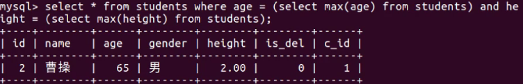

# 数据库操作

### mysql数据库的使用

```bash
sudo apt-get install mysql-server # 安装mysql服务端
sudo server mysql status # 查看mysql服务状态
sudo server mysql stop # 停止mysql服务
sudo server mysql start # 启动mysql服务
sudo server mysql restart # 重启mysql服务
sudo apt-get install mysql-client # 安装mysql客户端
mysql --help # 查看mysql命令的使用帮助
mysql -u用户名 -p密码 # mysql客户端连接服务端命令
mysql -u用户名 -p密码 数据库名称<name.sql # 导入sql文件
quit/exit/ctrl+d # 退出
```

### mysql数据类型和约束

数据类型和约束保证了表中数据的准确性和完整性

#### 数据类型

创建表时为表中字段指定的数据类型，使用原则：尽量选取值范围小的，节省空间

* **整形类型**

| 类型 | 字节大小 | 有符号范围\(Signed\) | 无符号范围\(Unsigned\) |
| :--- | :--- | :--- | :--- |
| TINYINT | 1 | -128 ~ 127 | 0 ~ 255 |
| SMALLINT | 2 | -32768 ~ 32767 | 0 ~ 65535 |
| MEDIUMINT | 3 | -8388608 ~ 8388607 | 0 ~ 16777215 |
| INT/INTEGER | 4 | -2147483648 ~2147483647 | 0 ~ 4294967295 |
| BIGINT | 8 | -9223372036854775808 ~ 9223372036854775807 | 0 ~ 18446744073709551615 |

* **小数类型**：decimal（浮点数），decimal\(5, 2\) 共存5位数，小数占 2 位
* **字符串**：varchar（可变字符串）char（固定长度字符串）char\(3\)，存'ab'为'ab '

| 类型 | 说明 | 使用场景 |
| :--- | :--- | :--- |
| CHAR | 固定长度，小型数据 | 身份证号、手机号、电话、密码 |
| VARCHAR | 可变长度，小型数据 | 姓名、地址、品牌、型号 |
| TEXT | 可变长度，字符个数大于 4000 | 存储小型文章或者新闻 |
| LONGTEXT | 可变长度， 极大型文本数据 | 存储极大型文本数据 |

* **时间类型**

| 类型 | 字节大小 | 示例 |
| :--- | :--- | :--- |
| DATE | 4 | '2020-01-01' |
| TIME | 3 | '12:29:59' |
| DATETIME | 8 | '2020-01-01 12:29:59' |
| YEAR | 1 | '2017' |
| TIMESTAMP | 4 | '1970-01-01 00:00:01' UTC ~ '2038-01-01 00:00:01' UTC |

#### 约束

在数据类型限定的基础上额外增加的要求

| 约束 | constraint | 介绍 |
| :--- | :--- | :--- |
| 主键 | primary key | 物理上的存储的 |
| 非空 | not null | 不许为空 |
| 唯一 | unique | 不许重复 |
| 默认 | default | 不填写时使用默认值 |
| 外键约束 | foreign key | 对关系字段进行约束, 关联的表中查询值是否存在, |

### sql语句基本使用

* **数据库操作**

```sql
select now(); # 查看当前时间
show databases; # 查看所有数据库
create database 数据库名 charset=utf8; # 创建数据库
use 数据库名; # 使用数据库
select database(); # 查看当前使用的数据库
drop database 数据库名; # 删除数据库
source areas.sql; # 执行sql文件给areas表导入数据
```

* **表结构操作**

```sql
show tables; # 查看当前数据库中所有表

create table 表名(
字段名称 数据类型  可选的约束条件,
);
create table students(
 id int unsigned primary key auto_increment not null,
 name varchar(20) not null,
 age tinyint unsigned default 0,
 height decimal(5,2),
 gender enum('男','女','人妖','保密')
);

alter table 表名 add 列名 类型 约束; # 修改表-添加字段
alter table students add birthday datetime;

alter table 表名 modify 列名 类型 约束; # 修改表-修改字段类型
alter table students modify birthday date not null;

alter table 表名 change 原名 新名 类型及约束; # 修改表-修改字段名和字段类型
alter table students change birthday birth datetime not null;

alter table 表名 drop 列名; # 修改表-删除字段
alter table students drop birthday;

show create table 表名; # 查看创表SQL语句
show create table students;

show create database 数据库名; # 查看创库SQL语句
show create database mytest;

drop table 表名; # 删除表
drop table students;
```

* **表数据操作**

```sql
select * from 表名; # 查询所有列
select * from students;

select 列1,列2,... from 表名; # 查询指定列
select id,name from students;

insert into 表名 values (...) # 全列插入：值的顺序与表结构字段的顺序完全一一对应
insert into students values(0, 'xx', default, default, '男');

insert into 表名 values (...),(...)...; # 全列多行插入
insert into students values(0, '张飞', 55, 1.75, '男'),(0, '关羽', 58, 1.85, '男');

insert into 表名(列1,...) values(值1,...) # 部分列插入：值的顺序与给出的列顺序对应
insert into students(name, age) values('王二小', 15);

insert into 表名(列1,...) values(值1,...),(值1,...)...; # 部分列多行插入
insert into students(name, height) values('刘备', 1.75),('曹操', 1.6);
-- 主键列是自动增长，但是在全列插入时需要占位，通常使用空值(0或者null或者default)
-- 在全列插入时，如果字段列有默认值可以使用 default 来占位，插入后的数据就是之前设置的默认值

update 表名 set 列1=值1,列2=值2... where 条件 # 修改数据
update students set age = 18, gender = '女' where id = 6;

delete from 表名 where 条件 # 删除数据
delete from students where id=5;
```

* **表查询操作**

```sql
-- 使用 as 给字段起别名，可以通过 as 给表起别名
select id as 序号, name as 名字, gender as 性别 from students;
select s.id,s.name,s.gender from students as s;

-- distinct可以去除重复数据行
select distinct 列1,... from 表名;
select distinct name, gender from students; # 看到了很多重复数据 想要对其中重复数据行进行去重操作可以使用 distinct

-- where条件查询
-- 比较运算符：= > >= < <= != <>
select * from students where id > 3;
-- 逻辑运算符：and or not 多个条件结合()
select * from students where not (age >= 10 and age <= 15);
-- 模糊查询：like是模糊查询关键字/%表示任意多个任意字符/_表示一个任意字符
select * from students where name like '黄%' or name like '_靖';
-- 范围查询：between .. and .. 表示在一个连续的范围内查询/in 表示在一个非连续的范围内查询
select * from students where id between 3 and 8;
select * from students where id in [1, 2, 3, 4];
-- 空判断：判断为空使用: is null/判断非空使用: is not null
select * from students where height is null;

-- asc升序查询和desc降序查询
select * from 表名 order by 列1 asc|desc [,列2 asc|desc,...]
select * from students order by age desc,height desc; # 先按照年龄从大->小排序，年龄相同时按身高从高->矮排序

-- limit 关键字实现分页查询 start表示开始行索引，默认是0 count表示查询条数
select * from 表名 limit start,count
select * from students where gender=1 limit 0,3;
select * from students limit (n-1)*m,m # 每页显示m条数据，求第n页显示的数据

-- 聚合函数 可结合分组(group by)使用，用于统计和计算分组数据
count(col): 表示求指定列的总行数
max(col): 表示求指定列的最大值
min(col): 表示求指定列的最小值
sum(col): 表示求指定列的和
avg(col): 表示求指定列的平均值
select avg(height) from students where gender = 1;
select avg(ifnull(height,0)) from students where gender = 1;

-- 分组查询按照指定字段分组，数据相等的分为一组
-- GROUP BY 列名 [HAVING 条件表达式] [WITH ROLLUP]
-- group by的使用 
select name, gender from students group by name, gender; # 根据name和gender字段进行分组
-- group by + group_concat()的使用 
select gender,group_concat(name) from students group by gender; # group_concat(字段名): 统计每个分组指定字段的信息集合，每个信息之间使用逗号进行分割
-- group by + 聚合函数的使用
select gender,count(*) from students group by gender; # 统计不同性别的人的个数
-- group by + having的使用
select gender,count(*) from students group by gender having count(*)>2; # 根据gender字段进行分组，统计分组条数大于2的
-- group by + with rollup的使用
select gender,group_concat(age) from students group by gender with rollup; # 根据gender字段进行分组，汇总所有人的年龄

-- 内连接查询 左连接查询 右连接查询 自连接查询  on就是连接查询条件
-- 查询两个表中符合条件的共有记录
select 字段 from 表1 inner join 表2 on 表1.字段1 = 表2.字段2
select * from students as s inner join classes as c on s.cls_id = c.id;
-- 以左表为主根据条件查询右表数据，如果根据条件查询右表数据不存在使用null值填充
select 字段 from 表1 left join 表2 on 表1.字段1 = 表2.字段2
-- 以右表为主根据条件查询左表数据，如果根据条件查询左表数据不存在使用null值填充
select 字段 from 表1 right join 表2 on 表1.字段1 = 表2.字段2
-- 自连接查询就是把一张表模拟成左右两张表，然后进行连表查询
select c.id, c.title, c.pid, p.title from areas as c inner join areas as p on c.pid = p.id where p.title = '山西省';
-- 一个select语句嵌入另外一个select语句, 被嵌入select语句为子查询语句，外部select语句为主查询
select * from students where age > (select avg(age) from students); # 查询大于平均年龄的学生
select name from classes where id in (select cls_id from students where cls_id is not null); # 查询学生在班的所有班级名字
select * from students where (age, height) =  (select max(age), max(height) from students); # 查找年龄最大,身高最高的学生
```





